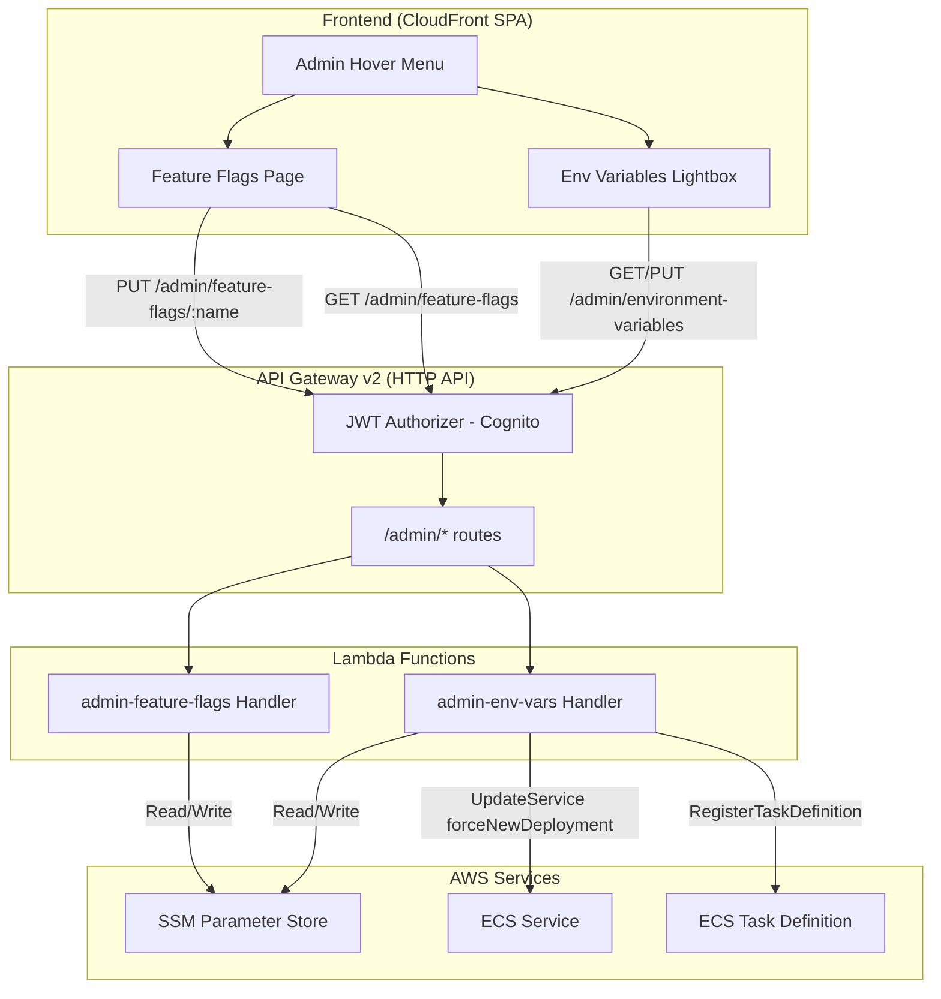
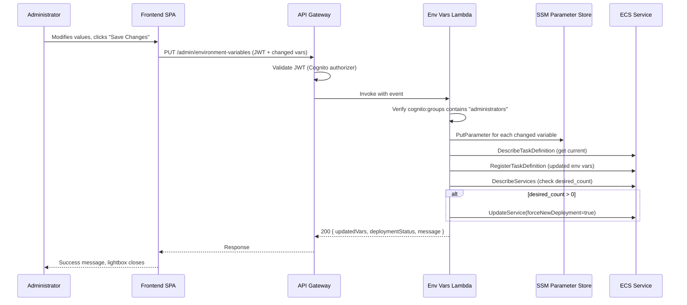

# Design Document: Administration Panel

## Overview

The Administration Panel adds a role-gated management interface to the Presentation Coaching Platform, enabling administrators to modify runtime environment variables and toggle feature flags without redeployment. The panel integrates into the existing SPA frontend (vanilla JS) and backend (API Gateway v2 + Lambda + CDK), reusing the established Cognito JWT authorization pattern with an additional server-side group membership check for defense in depth.

The design introduces:
- Two new frontend views (Environment Variables lightbox, Feature Flags page) with an admin-only hover menu
- Two new Lambda handler functions for the admin API endpoints
- SSM Parameter Store as the single source of truth for both env vars and feature flags
- ECS task definition updates and force-redeployment for env var changes
- A distinct visual theme (medium dark gray) to distinguish admin context

### Key Design Decisions

1. **SSM as source of truth** — Environment variables are read from SSM at display time (not from the ECS task definition), ensuring consistency even when deployments are in progress.
2. **Single Lambda for admin operations** — One Lambda handles both GET and PUT for environment variables (and a separate one for feature flags) to minimize cold start overhead and keep IAM policies focused.
3. **Immediate toggle persistence** — Feature flags persist on each toggle (no batch save), matching user expectations for simple on/off switches.
4. **Hardcoded model list in frontend** — The model dropdown list lives in the frontend JavaScript. When models change, only the frontend needs updating (no API change required).
5. **ECS desired_count=0 handling** — The backend gracefully skips force-deployment when the service has zero desired tasks, updating only SSM and the task definition.

---

## Architecture



### Request Flow — Environment Variable Update



---

## Components and Interfaces

### Frontend Components

#### 1. AdminMenu (`webapp/js/views/admin-menu.js`)

Renders the "Administration" label in the nav bar with a hover dropdown containing links to "Environment Variables" and "Feature Flags".

```javascript
/**
 * @param {HTMLElement} navContainer - The navigation links container
 * @returns {void}
 */
export function renderAdminMenu(navContainer) { ... }
```

**Visibility gate**: Only called when `isAdmin()` returns true (from `auth.js`).

#### 2. EnvVarsLightbox (`webapp/js/views/env-vars.js`)

A modal dialog that loads environment variables, displays them with appropriate input controls (dropdowns for models and concurrency, text for others), tracks changes, and submits only modified values.

```javascript
/**
 * Open the environment variables lightbox.
 * Fetches current values from API, renders controls, handles save/cancel.
 * @returns {void}
 */
export function openEnvVarsLightbox() { ... }

/**
 * Model options list — hardcoded current Amazon Nova and Anthropic Claude models.
 * Each entry: { displayName: string, modelId: string }
 * @type {Array<{displayName: string, modelId: string}>}
 */
export const MODEL_OPTIONS = [ ... ];

/**
 * MAX_CONCURRENT_EVALUATIONS dropdown options.
 * @type {number[]}
 */
export const CONCURRENCY_OPTIONS = [1, 2, 3, 5, 10];
```

#### 3. FeatureFlagsPage (`webapp/js/views/feature-flags.js`)

A full page (routed via hash `#feature-flags`) displaying all feature flags with iOS-style toggle switches. Each toggle immediately persists changes.

```javascript
/**
 * Render the Feature Flags administration page.
 * @param {HTMLElement} outlet - The router outlet element
 * @returns {void}
 */
export function render(outlet) { ... }
```

#### 4. Admin API Client Extension (`webapp/js/admin-api.js`)

New module extending the existing `api.js` pattern with admin-specific endpoints.

```javascript
export const adminApi = {
  /** @returns {Promise<Array<{name: string, value: string, description: string, inputType: string}>>} */
  async getEnvironmentVariables() { ... },

  /** @param {Object<string, string>} changedVars - Map of variable names to new values
   *  @returns {Promise<{updatedVars: string[], deploymentStatus: string, message: string}>} */
  async updateEnvironmentVariables(changedVars) { ... },

  /** @returns {Promise<Array<{name: string, enabled: boolean, description: string}>>} */
  async getFeatureFlags() { ... },

  /** @param {string} flagName
   *  @param {boolean} enabled
   *  @returns {Promise<{name: string, enabled: boolean}>} */
  async updateFeatureFlag(flagName, enabled) { ... },
};
```

### Backend Components

#### 5. Admin Environment Variables Handler (`upload-service/src/handlers/admin_env_vars.py`)

Lambda handler supporting both GET and PUT for `/admin/environment-variables`.

```python
def handler(event: dict, context) -> dict:
    """Route GET/PUT /admin/environment-variables.
    
    GET: Read all env var values from SSM, return with descriptions.
    PUT: Write changed values to SSM, update ECS task definition, trigger force-deploy.
    
    Defense in depth: Verifies 'administrators' in cognito:groups claim.
    """
```

**SSM Parameter paths** (under `/prescoach/{env}/admin/env-vars/`):
- `SESSION_SUPERVISOR_MODEL_ID`
- `COACHING_SUPERVISOR_MODEL_ID`
- `EVALUATION_MODEL_ID`
- `IDLE_TIMEOUT_MINUTES`
- `MAX_CONCURRENT_EVALUATIONS`
- `COGNITO_USER_POOL_NAME`

#### 6. Admin Feature Flags Handler (`upload-service/src/handlers/admin_feature_flags.py`)

Lambda handler supporting GET for `/admin/feature-flags` and PUT for `/admin/feature-flags/{flag-name}`.

```python
def handler(event: dict, context) -> dict:
    """Route GET /admin/feature-flags and PUT /admin/feature-flags/{flag-name}.
    
    GET: Read all feature flag values from SSM, return with descriptions.
    PUT: Write single flag value to SSM.
    
    Defense in depth: Verifies 'administrators' in cognito:groups claim.
    """
```

**SSM Parameter paths** (under `/prescoach/{env}/feature-flags/`):
- `video-processing-enabled`
- `batch-processing-enabled`
- `embeddings-enabled`
- `local-mode`

#### 7. Admin Authorization Helper (`upload-service/src/utils/admin_auth.py`)

Shared utility for verifying administrator group membership from the JWT claims in the API Gateway event.

```python
def verify_admin(event: dict) -> tuple[bool, str | None]:
    """Extract and verify administrator group membership from JWT claims.
    
    Args:
        event: API Gateway v2 event with requestContext.authorizer.jwt.claims
        
    Returns:
        (True, user_id) if admin, (False, None) if not
    """
```

#### 8. ECS Deployment Service (`upload-service/src/services/ecs_service.py`)

Service class encapsulating ECS task definition updates and force-deployment logic.

```python
class EcsService:
    """Manages ECS task definition updates and service redeployment."""
    
    def update_task_environment(self, task_family: str, env_updates: dict[str, str]) -> str:
        """Register a new task definition revision with updated environment variables.
        
        Returns the new task definition ARN.
        """
    
    def force_new_deployment(self, cluster: str, service: str, task_definition_arn: str) -> dict:
        """Trigger ECS force-new-deployment. 
        
        Skips if desired_count is 0 (no running tasks to replace).
        Returns deployment status info.
        """
```

### CDK Infrastructure Changes

#### 9. New Routes and Lambda Integration (`upload-service/cdk/upload_service/upload_service_stack.py`)

Add to existing stack:
- Two new Lambda functions (`admin-env-vars`, `admin-feature-flags`)
- Four new API Gateway routes with JWT authorizer
- IAM policies: SSM read/write for admin parameter prefixes, ECS `DescribeTaskDefinition`, `RegisterTaskDefinition`, `UpdateService`, `DescribeServices` for the evaluation cluster/service
- CORS update to include `PUT` method

---

## Data Models

### SSM Parameter Store Schema

```
/prescoach/{env}/admin/env-vars/
├── SESSION_SUPERVISOR_MODEL_ID     (String: Bedrock model ID)
├── COACHING_SUPERVISOR_MODEL_ID    (String: Bedrock model ID)
├── EVALUATION_MODEL_ID             (String: Bedrock model ID)
├── IDLE_TIMEOUT_MINUTES            (String: numeric string)
├── MAX_CONCURRENT_EVALUATIONS      (String: numeric string)
└── COGNITO_USER_POOL_NAME          (String: pool name)

/prescoach/{env}/feature-flags/
├── video-processing-enabled        (String: "true" | "false")
├── batch-processing-enabled        (String: "true" | "false")
├── embeddings-enabled              (String: "true" | "false")
└── local-mode                      (String: "true" | "false")
```

### API Request/Response Schemas

#### GET /admin/environment-variables — Response

```json
{
  "variables": [
    {
      "name": "SESSION_SUPERVISOR_MODEL_ID",
      "value": "us.anthropic.claude-sonnet-4-6",
      "description": "Foundation model used by the Session Supervisor agent",
      "inputType": "model-dropdown"
    },
    {
      "name": "IDLE_TIMEOUT_MINUTES",
      "value": "30",
      "description": "Minutes of inactivity before the ECS evaluation task exits",
      "inputType": "text"
    },
    {
      "name": "MAX_CONCURRENT_EVALUATIONS",
      "value": "5",
      "description": "Maximum number of submissions processed simultaneously",
      "inputType": "concurrency-dropdown"
    }
  ]
}
```

#### PUT /admin/environment-variables — Request

```json
{
  "variables": {
    "SESSION_SUPERVISOR_MODEL_ID": "us.amazon.nova-pro-v1:0",
    "IDLE_TIMEOUT_MINUTES": "45"
  }
}
```

#### PUT /admin/environment-variables — Response

```json
{
  "updatedVars": ["SESSION_SUPERVISOR_MODEL_ID", "IDLE_TIMEOUT_MINUTES"],
  "deploymentStatus": "triggered",
  "message": "Configuration saved. ECS service redeployment triggered — new tasks will use updated values within minutes."
}
```

#### GET /admin/feature-flags — Response

```json
{
  "flags": [
    {
      "name": "video-processing-enabled",
      "enabled": true,
      "description": "Allow video file uploads to be processed (audio extraction via MediaConvert)"
    },
    {
      "name": "embeddings-enabled",
      "enabled": true,
      "description": "Create vector embeddings from audio chunks during preparation (when disabled, evaluation uses transcript only)"
    }
  ]
}
```

#### PUT /admin/feature-flags/{flag-name} — Request

```json
{
  "enabled": false
}
```

#### PUT /admin/feature-flags/{flag-name} — Response

```json
{
  "name": "embeddings-enabled",
  "enabled": false
}
```

### Frontend Model Options Data

```javascript
export const MODEL_OPTIONS = [
  // Amazon Nova models
  { displayName: "Amazon Nova Pro CRI", modelId: "us.amazon.nova-pro-v1:0" },
  { displayName: "Amazon Nova Pro (Single Region)", modelId: "amazon.nova-pro-v1:0" },
  { displayName: "Amazon Nova Lite CRI", modelId: "us.amazon.nova-lite-v1:0" },
  { displayName: "Amazon Nova Lite (Single Region)", modelId: "amazon.nova-lite-v1:0" },
  { displayName: "Amazon Nova Micro CRI", modelId: "us.amazon.nova-micro-v1:0" },
  { displayName: "Amazon Nova Micro (Single Region)", modelId: "amazon.nova-micro-v1:0" },
  // Anthropic Claude models
  { displayName: "Claude Sonnet 4 CRI", modelId: "us.anthropic.claude-sonnet-4-6" },
  { displayName: "Claude Sonnet 4 (Single Region)", modelId: "anthropic.claude-sonnet-4-6" },
  { displayName: "Claude Haiku 3.5 CRI", modelId: "us.anthropic.claude-3-5-haiku-20241022-v1:0" },
  { displayName: "Claude Haiku 3.5 (Single Region)", modelId: "anthropic.claude-3-5-haiku-20241022-v1:0" },
  { displayName: "Claude Sonnet 3.5 v2 CRI", modelId: "us.anthropic.claude-3-5-sonnet-20241022-v2:0" },
  { displayName: "Claude Sonnet 3.5 v2 (Single Region)", modelId: "anthropic.claude-3-5-sonnet-20241022-v2:0" },
];
```

---


## Correctness Properties

*A property is a characteristic or behavior that should hold true across all valid executions of a system — essentially, a formal statement about what the system should do. Properties serve as the bridge between human-readable specifications and machine-verifiable correctness guarantees.*

### Property 1: Variable rendering includes all required fields

*For any* environment variable object with a non-empty name, description, and value, the rendered HTML output shall contain the variable name as a label, the description text, and an editable input control pre-filled with the current value.

**Validates: Requirements 3.3**

### Property 2: Input type determines rendered control type

*For any* environment variable with `inputType` of "model-dropdown", the rendered control shall be a `<select>` element populated with options where each option's display text (human-friendly name) differs from its value attribute (API model ID); for variables with `inputType` of "text", the rendered control shall be an `<input type="text">` element.

**Validates: Requirements 4.1, 4.4**

### Property 3: Dropdown selection reflects current value validity

*For any* model dropdown where the current value matches a known model ID in MODEL_OPTIONS, that option shall be pre-selected; *for any* current value that does not match any entry in MODEL_OPTIONS, the dropdown shall display an unselected/placeholder state indicating the value is invalid or legacy.

**Validates: Requirements 4.6, 4.7**

### Property 4: Change tracking round-trip preserves clean state

*For any* environment variable with an original value, if the value is changed to a different value (setting Changed_Flag to true) and then changed back to the original value, the Changed_Flag shall be false — identical to the initial state.

**Validates: Requirements 5.1, 5.2, 5.3**

### Property 5: Save payload contains exactly the changed variables

*For any* set of environment variables with mixed Changed_Flag states (some true, some false), the constructed save payload shall include all and only those variables whose Changed_Flag is true; variables with Changed_Flag false shall not appear in the payload.

**Validates: Requirements 5.5, 6.1**

### Property 6: Feature flag rendering includes all required fields

*For any* feature flag object with a non-empty name, description, and boolean state, the rendered output shall contain the flag's parameter name, its description text, and a toggle switch control reflecting the current boolean state.

**Validates: Requirements 7.3**

### Property 7: Failed toggle reverts to original state

*For any* feature flag in any boolean state (true or false), if the user toggles it and the backend API request fails, the toggle switch shall revert to the original state prior to the toggle attempt.

**Validates: Requirements 7.7**

### Property 8: Non-administrator requests receive 403

*For any* API request to an administration endpoint where the JWT token's `cognito:groups` claim does not contain "administrators", the Lambda handler shall return HTTP 403 Forbidden regardless of the request method or payload content.

**Validates: Requirements 8.5, 8.6, 9.1, 9.2, 9.3**

### Property 9: PUT environment-variables response contains required fields

*For any* successful PUT request to `/admin/environment-variables` with one or more changed variables, the response body shall contain: a `updatedVars` array listing exactly the variable names that were updated, a `deploymentStatus` string, and a `message` string.

**Validates: Requirements 8.8**

---

## Error Handling

Error handling follows the project's established patterns from the error-handling steering file:

### Unrecoverable Errors (Fail Immediately)

| Error | Trigger | Response |
|-------|---------|----------|
| Non-admin access | JWT missing "administrators" group | 403 Forbidden with message |
| Invalid variable name | PUT with unknown variable name | 400 Bad Request |
| Invalid model ID | PUT with model ID not in allowed list | 400 Bad Request |
| Invalid flag name | PUT /feature-flags/{name} with unknown flag | 404 Not Found |
| Malformed request body | Missing required fields or invalid JSON | 400 Bad Request |

### Recoverable Errors (Retry in Lambda)

| Error | Trigger | Handling |
|-------|---------|----------|
| SSM throttling | Too many parameter operations | Retry 3x with exponential backoff + jitter |
| ECS service unavailable | Temporary ECS API issues | Retry 3x with exponential backoff + jitter |

### Frontend Error Handling

| Scenario | Behavior |
|----------|----------|
| GET env vars fails | Show error message in lightbox, offer retry |
| PUT env vars fails | Show error in lightbox, keep lightbox open for retry |
| GET feature flags fails | Show error message on page, offer retry |
| Toggle persist fails | Revert toggle to original state, show error toast |
| Network error | Show "Network unavailable" toast |
| 401 response | Attempt token refresh, then redirect to login |
| 403 response | Show "You do not have permission" message, close admin view |

### ECS Deployment Edge Cases

| Scenario | Handling |
|----------|----------|
| desired_count = 0 | Update SSM and task definition only, skip force-deploy. Return `deploymentStatus: "skipped_no_running_tasks"` |
| ECS force-deploy fails | Return error with details. SSM is already updated (eventual consistency — next manual deploy will use new values) |
| Task definition register fails | Return error before attempting force-deploy. SSM is already updated |

---

## Testing Strategy

### Unit Tests (Vitest — Frontend)

- Admin menu visibility based on `isAdmin()` state
- Lightbox open/close behavior
- Cancel button discards changes
- Save button disabled when model dropdown is in invalid/unselected state
- Model dropdown renders correct options
- Concurrency dropdown renders [1, 2, 3, 5, 10]
- Toast notification appears on success/error
- Direct URL navigation to admin routes blocked for non-admins
- Hover dropdown show/hide with 300ms delay

### Unit Tests (pytest — Backend)

- Admin auth verification: valid admin JWT → proceed, non-admin → 403
- GET handler returns correct structure with SSM values (mocked)
- PUT handler calls SSM put_parameter for each changed variable (mocked)
- PUT handler calls ECS register_task_definition with correct env vars (mocked)
- PUT handler skips force-deploy when desired_count = 0 (mocked)
- Feature flag GET returns all flags with correct boolean values
- Feature flag PUT updates single parameter in SSM
- Invalid variable names rejected with 400
- Invalid flag names rejected with 404
- Malformed request bodies rejected with 400

### Property-Based Tests (fast-check — Frontend)

**Library**: fast-check (already installed in `webapp/package.json`)
**Minimum iterations**: 100 per property

Each property test references its design document property:

- **Feature: admin-panel, Property 1**: Generate random variable objects, verify rendering includes name, description, and control
- **Feature: admin-panel, Property 2**: Generate random variables with varying inputTypes, verify correct control element rendered
- **Feature: admin-panel, Property 3**: Generate random model IDs (both valid from MODEL_OPTIONS and invalid arbitrary strings), verify dropdown selection behavior
- **Feature: admin-panel, Property 4**: Generate random original/modified value pairs, verify change tracking round-trip
- **Feature: admin-panel, Property 5**: Generate random sets of variables with random changed flags, verify payload construction
- **Feature: admin-panel, Property 6**: Generate random feature flag objects, verify rendering includes name, description, and toggle
- **Feature: admin-panel, Property 7**: Generate random flag states and toggle directions, mock API failure, verify revert

### Property-Based Tests (Hypothesis — Backend)

**Library**: Hypothesis (already used in `upload-service` and `agentic-evaluation`)
**Minimum iterations**: 100 per property

- **Feature: admin-panel, Property 8**: Generate random JWT claims without "administrators" group, verify 403 for all admin endpoints
- **Feature: admin-panel, Property 9**: Generate random sets of variable names and values, verify PUT response structure

### Integration Tests

- Full API flow: GET env vars → modify → PUT → verify SSM updated (with mocked AWS clients)
- Full API flow: GET flags → toggle one → verify SSM updated (with mocked AWS clients)
- ECS deployment flow: PUT env vars → verify task definition registered → verify update_service called
- End-to-end admin auth: non-admin token → verify 403 from each endpoint

### CDK Assertion Tests

- Admin Lambda functions created with correct environment variables
- API Gateway routes created for all admin endpoints
- IAM policies grant least-privilege access to SSM, ECS
- CORS configuration includes PUT method
