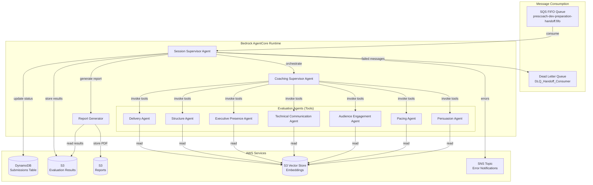
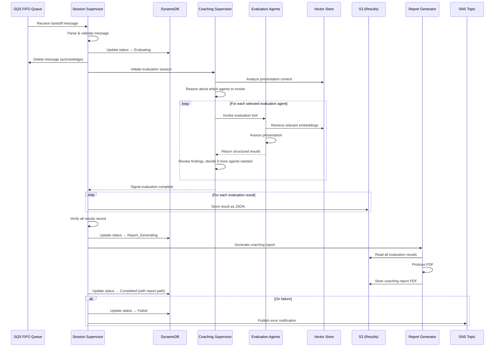
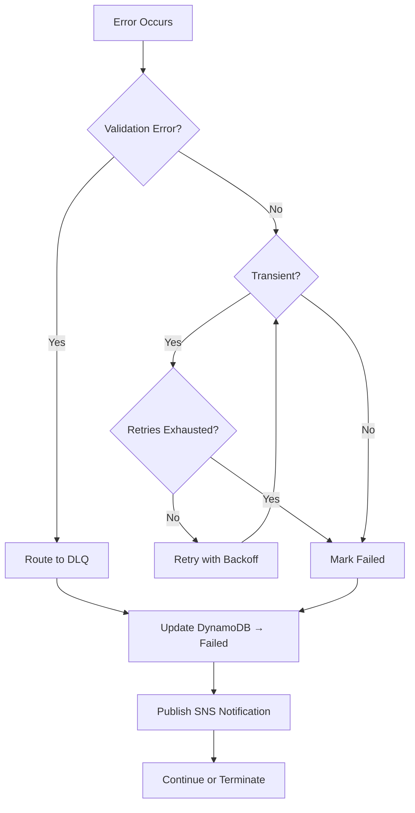

# Design Document: Agentic Evaluation

## Overview

The Agentic Evaluation work unit is the intelligence layer of the Presentation Coaching Platform. It consumes processed presentation data from the Preparation Workflow via a FIFO SQS queue and orchestrates multiple evaluation agents to assess presentations through different lenses (delivery, structure, executive presence, technical communication, audience engagement, pacing, persuasion). A Session Supervisor manages the overall lifecycle, a Coaching Supervisor dynamically selects and orchestrates evaluators using Bedrock AgentCore reasoning, and a Report Generator produces comprehensive PDF coaching reports.

The design uses the **Agents as Tools** multi-agent collaboration pattern from the [Strands Agents SDK](https://strandsagents.com), deployed on [Amazon Bedrock AgentCore Runtime](https://docs.aws.amazon.com/bedrock-agentcore/latest/devguide/what-is-bedrock-agentcore.html). This pattern wraps each evaluation agent as a callable tool that the Coaching Supervisor can invoke, providing separation of concerns, modularity, and hierarchical decision-making while allowing the supervisor to reason about which evaluators to invoke and whether additional analysis is warranted.

### Key Design Decisions

| Decision | Choice | Rationale |
|----------|--------|-----------|
| Agent framework | Strands Agents SDK + Bedrock AgentCore Runtime | Framework-agnostic deployment with managed runtime, session isolation, and memory. Strands provides the multi-agent orchestration patterns natively. |
| Multi-agent pattern | Agents as Tools (hierarchical) | Coaching Supervisor acts as orchestrator, evaluation agents are tools it invokes. Allows dynamic selection and iterative invocation based on findings. |
| Agent registration | Configuration-based discovery | Evaluation agents registered via a JSON manifest loaded at runtime. New agents added without code changes to orchestration. |
| Memory | AgentCore Memory (short-term session) | Maintains session context across evaluation lifecycle without custom state management. |
| PDF generation | ReportLab (Python) | Mature Python PDF library, no external dependencies, runs in Lambda/AgentCore Runtime. |
| Local development | Strands Agents local execution | Strands agents run locally without cloud deployment for development and testing. |

## Architecture



### Execution Flow



## Components and Interfaces

### Session Supervisor Agent

The top-level agent responsible for the entire evaluation lifecycle. Implemented as a Strands Agent deployed on AgentCore Runtime.

**Responsibilities:**
- Consume messages from the SQS FIFO handoff queue
- Parse and validate handoff message fields
- Manage DynamoDB status transitions (Evaluating → Report_Generating → Completed / Failed)
- Delegate evaluation orchestration to the Coaching Supervisor
- Store evaluation results in S3
- Trigger report generation
- Handle failures: DLQ routing, SNS notifications, status updates

**Interface:**
```python
class SessionSupervisor:
    """Top-level orchestrator for the evaluation session lifecycle."""
    
    async def handle_message(self, message: HandoffMessage) -> SessionResult:
        """Process a single handoff message through the full evaluation pipeline."""
        ...
    
    async def consume_queue(self) -> None:
        """Long-poll the SQS FIFO queue and process messages sequentially."""
        ...
```

### Coaching Supervisor Agent

The reasoning agent that dynamically selects and orchestrates evaluation agents. Implemented as a Strands Agent with evaluation agents registered as tools.

**Responsibilities:**
- Analyze presentation context (title, metadata, embeddings) to determine appropriate evaluators
- Invoke selected evaluation agents via the Agents as Tools pattern
- Review results from each agent and determine if additional evaluation is warranted
- Support iterative invocation based on findings from earlier evaluations
- Signal completion when all warranted evaluations are done

**Interface:**
```python
class CoachingSupervisor:
    """Orchestrates evaluation agents based on presentation context."""
    
    async def evaluate(
        self,
        submission_id: str,
        vector_store_location: str,
        chunk_count: int,
        presentation_title: str,
        metadata: dict
    ) -> list[EvaluationResult]:
        """Run the full evaluation orchestration, returning all results."""
        ...
```

### Evaluation Agent (Standard Contract)

Each evaluation agent is a Strands tool that the Coaching Supervisor can invoke. All agents share a standard input/output contract.

**Input Contract:**
```python
class EvaluationInput:
    """Standard input for all evaluation agents."""
    submission_id: str
    vector_store_location: str
    chunk_count: int
    presentation_title: str
    metadata: dict  # Additional context from handoff
```

**Output Contract:**
```python
class EvaluationResult:
    """Standard output from all evaluation agents."""
    dimension_name: str          # e.g., "delivery", "structure"
    agent_identifier: str        # Unique agent ID
    timestamp: str               # ISO 8601
    findings: list[Finding]      # Key observations
    scores: dict[str, float]     # Dimension-specific scores
    detailed_feedback: str       # Comprehensive coaching feedback
    strengths: list[str]         # Identified strengths
    improvements: list[str]      # Areas for improvement with suggestions
```

### Report Generator

Aggregates evaluation results and produces a PDF coaching report.

**Interface:**
```python
class ReportGenerator:
    """Produces PDF coaching reports from aggregated evaluation results."""
    
    async def generate(
        self,
        submission_id: str,
        user_id: str,
        presentation_title: str,
        evaluation_results: list[EvaluationResult]
    ) -> str:
        """Generate PDF and return S3 path where it was stored."""
        ...
```

### Agent Registry

Configuration-driven discovery mechanism for evaluation agents.

**Interface:**
```python
class AgentRegistry:
    """Discovers available evaluation agents at runtime."""
    
    def get_available_agents(self) -> list[AgentDescriptor]:
        """Return all registered evaluation agent descriptors."""
        ...
    
    def get_agent_by_dimension(self, dimension: str) -> AgentDescriptor | None:
        """Lookup a specific agent by its evaluation dimension."""
        ...
```

**Agent Descriptor (Registration Manifest):**
```json
{
  "agents": [
    {
      "agent_id": "delivery-evaluator-v1",
      "dimension": "delivery",
      "display_name": "Delivery Evaluator",
      "description": "Assesses vocal variety, pace, pauses, filler words, energy, and projection",
      "version": "1.0.0",
      "enabled": true,
      "tool_module": "agents.delivery_evaluator"
    }
  ]
}
```

### SQS Consumer

Handles FIFO queue consumption with proper ordering, acknowledgment, and DLQ routing.

**Interface:**
```python
class SQSConsumer:
    """Consumes messages from the SQS FIFO handoff queue."""
    
    async def receive_message(self) -> SQSMessage | None:
        """Long-poll for next message. Returns None on empty receive."""
        ...
    
    async def acknowledge(self, receipt_handle: str) -> None:
        """Delete message from queue after successful processing initiation."""
        ...
    
    async def send_to_dlq(self, message_body: str, failure_reason: str) -> None:
        """Route failed message to the dead-letter queue."""
        ...
```

### Status Manager

Manages DynamoDB status transitions with consistent error handling.

**Interface:**
```python
class StatusManager:
    """Manages submission processing status in DynamoDB."""
    
    async def update_status(
        self,
        submission_id: str,
        status: ProcessingStatus,
        report_path: str | None = None,
        failure_reason: str | None = None
    ) -> None:
        """Update the processing status of a submission."""
        ...
```

### Error Notifier

Publishes structured error notifications to SNS on a best-effort basis.

**Interface:**
```python
class ErrorNotifier:
    """Publishes error notifications to SNS (best-effort)."""
    
    async def notify(
        self,
        submission_id: str,
        component_name: str,
        error_type: str,
        error_message: str,
        retry_count_exhausted: int
    ) -> None:
        """Publish error notification. Fails silently if SNS is unavailable."""
        ...
```

## Data Models

### Handoff Message (Input)

Consumed from the SQS FIFO queue. Already defined by the Preparation Workflow:

```python
class HandoffMessage(BaseModel):
    """Message received from the Preparation Workflow handoff queue."""
    submission_id: str = Field(..., min_length=1)
    user_id: str = Field(..., min_length=1)
    s3_file_key: str = Field(..., min_length=1)
    vector_store_location: str = Field(..., min_length=1)
    chunk_count: int = Field(..., ge=1)
    presentation_title: str = Field(..., min_length=1)
```

### Processing Status

```python
class ProcessingStatus(str, Enum):
    """Valid processing status values for DynamoDB."""
    PENDING = "Pending"
    PROCESSING = "Processing"
    EVALUATING = "Evaluating"
    REPORT_GENERATING = "Report_Generating"
    COMPLETED = "Completed"
    FAILED = "Failed"
```

### Evaluation Result (S3 Storage)

Stored at `evaluations/{submission_id}/{dimension_name}.json`:

```python
class Finding(BaseModel):
    """A single observation from an evaluation agent."""
    category: str           # e.g., "vocal_variety", "filler_words"
    observation: str        # What was observed
    evidence: str           # Supporting evidence from the presentation
    severity: str           # "strength", "minor", "major", "critical"

class EvaluationResult(BaseModel):
    """Structured evaluation result from a single agent."""
    dimension_name: str
    agent_identifier: str
    timestamp: str                  # ISO 8601
    findings: list[Finding]
    scores: dict[str, float]        # Scores per sub-dimension (0.0 - 10.0)
    detailed_feedback: str
    strengths: list[str]
    improvements: list[str]
```

### Agent Descriptor (Registry)

```python
class AgentDescriptor(BaseModel):
    """Describes a registered evaluation agent."""
    agent_id: str
    dimension: str
    display_name: str
    description: str
    version: str
    enabled: bool = True
    tool_module: str  # Python module path for the tool implementation
```

### SNS Error Notification

```python
class ErrorNotification(BaseModel):
    """Structured error notification published to SNS."""
    submission_id: str
    component_name: str        # Agent name or service that failed
    error_type: str
    error_message: str
    retry_count_exhausted: int
    timestamp: str             # ISO 8601
    queue_name: str | None = None  # For DLQ-related failures
```

### Session Result

```python
class SessionResult(BaseModel):
    """Result of a complete evaluation session."""
    submission_id: str
    status: ProcessingStatus
    evaluation_results: list[EvaluationResult]
    report_s3_path: str | None = None
    failure_reason: str | None = None
    duration_seconds: float
```

### S3 Path Conventions

| Content | Path Pattern | Example |
|---------|-------------|---------|
| Evaluation results | `evaluations/{submission_id}/{dimension_name}.json` | `evaluations/sub-98765/delivery.json` |
| Coaching report | `reports/{user_id}/{submission_id}/coaching_report.pdf` | `reports/abc123/sub-98765/coaching_report.pdf` |


## Correctness Properties

*A property is a characteristic or behavior that should hold true across all valid executions of a system — essentially, a formal statement about what the system should do. Properties serve as the bridge between human-readable specifications and machine-verifiable correctness guarantees.*

### Property 1: Handoff message parsing round-trip

*For any* valid HandoffMessage with arbitrary submission_id, user_id, s3_file_key, vector_store_location, chunk_count, and presentation_title values, serializing the message to JSON and then parsing it back SHALL produce an identical HandoffMessage with all fields preserved.

**Validates: Requirements 1.2**

### Property 2: Invalid messages produce DLQ routing

*For any* handoff message body that violates the schema (missing required fields, empty strings where min_length=1 is required, chunk_count < 1, non-string types in string fields, or malformed JSON), the Session Supervisor's validation logic SHALL reject the message and signal DLQ routing.

**Validates: Requirements 1.4**

### Property 3: Evaluation agent output schema compliance

*For any* valid EvaluationInput provided to any registered evaluation agent, the agent SHALL produce an EvaluationResult containing a non-empty dimension_name, a non-empty agent_identifier, a valid ISO 8601 timestamp, a non-empty list of findings, a non-empty scores dictionary with values between 0.0 and 10.0, non-empty detailed_feedback, and at least one entry in strengths and improvements.

**Validates: Requirements 3.5, 4.3**

### Property 4: Agent failure resilience

*For any* evaluation session where one or more agents fail during execution, all non-failing agents SHALL still produce their evaluation results, and the system SHALL log each failure and trigger an error notification for each failed agent.

**Validates: Requirements 4.4**

### Property 5: S3 path construction correctness

*For any* submission_id, dimension_name, and user_id, the evaluation result path SHALL always equal `evaluations/{submission_id}/{dimension_name}.json` and the report path SHALL always equal `reports/{user_id}/{submission_id}/coaching_report.pdf`.

**Validates: Requirements 5.1, 6.5**

### Property 6: Evaluation result serialization round-trip

*For any* valid EvaluationResult instance, serializing to JSON and deserializing back SHALL produce an equivalent EvaluationResult with all fields (dimension_name, agent_identifier, timestamp, findings, scores, detailed_feedback, strengths, improvements) preserved.

**Validates: Requirements 5.2**

### Property 7: Evaluation completeness verification

*For any* set of expected evaluation dimensions and any set of files present in S3, the completeness verification logic SHALL return true if and only if every expected dimension has a corresponding file present.

**Validates: Requirements 5.3**

### Property 8: Exponential backoff with jitter

*For any* retry attempt number N (1 ≤ N ≤ max_attempts) and base interval B, the computed backoff delay SHALL be greater than or equal to 0 and less than or equal to B × 2^(N-1), and successive delays SHALL be non-decreasing in expectation.

**Validates: Requirements 5.4**

### Property 9: Report contains all required sections

*For any* non-empty set of EvaluationResult instances covering one or more dimensions, the generated report content SHALL contain an executive summary section, a detailed feedback section for each dimension present in the input, at least one strength, at least one improvement suggestion, and an overall coaching assessment.

**Validates: Requirements 6.2, 6.4**

### Property 10: FIFO ordering preserved

*For any* sequence of N messages placed on the FIFO queue, the Session Supervisor SHALL process them in the same order they were received (message processed at position i was received at position i).

**Validates: Requirements 8.2**

### Property 11: Error notification structure compliance

*For any* error context (submission_id, component_name, error_type, error_message, retry_count_exhausted, timestamp), the constructed SNS error notification SHALL contain all six fields, with timestamp in valid ISO 8601 format and all string fields non-empty.

**Validates: Requirements 9.3, 11.2**

### Property 12: Partial failure notification accuracy

*For any* evaluation session where a subset of agents completed and a subset failed, the error notification SHALL correctly list all completed agent names and all failed agent names with no omissions or spurious entries.

**Validates: Requirements 9.4**

### Property 13: Failure status always includes reason

*For any* unrecoverable failure occurring at any point in the evaluation session, the DynamoDB status update SHALL set the status to Failed and include a non-empty failure_reason string.

**Validates: Requirements 10.5**

### Property 14: System functions with any agent subset

*For any* non-empty subset of evaluation agents enabled in the registry (with remaining agents disabled or removed), the Coaching Supervisor SHALL successfully orchestrate evaluation using only the available agents and produce valid results without errors.

**Validates: Requirements 3.4**

## Error Handling

### Error Handling Strategy

The error handling follows the same patterns established in the Preparation Workflow — fail fast on validation, retry transient failures with exponential backoff, and route unrecoverable failures to the DLQ with SNS notifications.

### Error Categories

| Category | Examples | Strategy |
|----------|----------|----------|
| **Validation Errors** | Malformed message, missing fields, invalid types | Immediate DLQ routing + SNS notification. No retry. |
| **Transient AWS Errors** | S3 write timeout, DynamoDB throttling, SNS publish failure | Exponential backoff with jitter, configurable max retries (default: 3) |
| **Agent Execution Errors** | Evaluation agent throws exception, LLM timeout | Log failure, notify via SNS, continue with remaining agents |
| **Report Generation Errors** | PDF library failure, template error | Retry up to configurable max attempts, then mark Failed |
| **Unrecoverable Errors** | All retries exhausted, critical infrastructure failure | Update DynamoDB → Failed with reason, publish SNS notification |

### Retry Configuration

```python
class RetryConfig(BaseModel):
    """Configuration for retry behavior."""
    max_attempts: int = 3
    base_delay_seconds: float = 2.0
    backoff_multiplier: float = 2.0
    max_delay_seconds: float = 60.0
    jitter: bool = True  # Adds randomness to prevent thundering herd
```

### Error Flow



### Best-Effort SNS Notifications

SNS notifications are published on a best-effort basis. If the SNS publish itself fails:
1. Log the failure locally
2. Do NOT retry the SNS publish (avoid cascading failures)
3. Do NOT let the SNS failure affect the evaluation session outcome
4. The DynamoDB status record serves as the authoritative failure record

### Partial Failure Handling

When an evaluation session fails midway (some agents completed, some failed):
1. Store whatever results were successfully obtained
2. Update DynamoDB status to Failed
3. Include in the failure record: which agents completed, which failed, and the failure reasons
4. Publish a detailed SNS notification with partial completion information
5. Do NOT generate a report from incomplete data (to avoid misleading feedback)

## Testing Strategy

### Dual Testing Approach

The Agentic Evaluation work unit uses both property-based tests and example-based unit tests, following the same pattern established in the Preparation Workflow.

### Property-Based Testing

**Library:** [Hypothesis](https://hypothesis.readthedocs.io/) (Python)

**Configuration:**
```toml
[tool.hypothesis]
max_examples = 100
deadline = 500
```

Each correctness property from the design document is implemented as a single property-based test with:
- Minimum 100 iterations per property
- Tag format: `# Feature: agentic-evaluation, Property {N}: {property_text}`
- Custom strategies for generating HandoffMessage, EvaluationResult, EvaluationInput, and ErrorNotification instances

**Property tests target the pure logic layer:**
- Message parsing and validation
- S3 path construction
- Serialization/deserialization round-trips
- Completeness verification logic
- Exponential backoff calculation
- Error notification construction
- Report section verification (against mock report generation)

### Unit Tests (Example-Based)

Unit tests cover specific examples, integration points, and edge cases:

| Area | Tests |
|------|-------|
| Message consumption | Successful consumption, empty queue, malformed JSON |
| Status transitions | Happy path (Evaluating → Report_Generating → Completed), failure paths |
| Agent registry | Agent discovery, disabled agents filtered, empty registry |
| DLQ routing | Message routing on validation failure, midway failure |
| SNS notifications | Correct format, best-effort isolation, partial failure details |
| Report generation | Single dimension, all dimensions, minimum content verification |
| Retry logic | First attempt succeeds, max retries exhausted, backoff timing |

### Integration Tests

Integration tests verify end-to-end flows with mocked AWS services (using [moto](https://github.com/getmoto/moto)):

| Scenario | Services Mocked |
|----------|----------------|
| Full happy path | SQS, DynamoDB, S3, SNS |
| Agent failure mid-session | SQS, DynamoDB, S3, SNS |
| S3 write failure with retries | S3 (configured to fail N times) |
| DLQ routing on invalid message | SQS, DynamoDB, SNS |
| Report generation and storage | S3 |

### Test Directory Structure

```
agentic-evaluation/
├── tests/
│   ├── __init__.py
│   ├── conftest.py              # Shared fixtures, strategies
│   ├── properties/
│   │   ├── __init__.py
│   │   ├── test_message_parsing.py     # Properties 1, 2
│   │   ├── test_evaluation_output.py   # Properties 3, 6
│   │   ├── test_s3_paths.py            # Property 5
│   │   ├── test_completeness.py        # Property 7
│   │   ├── test_retry_backoff.py       # Property 8
│   │   ├── test_report_sections.py     # Property 9
│   │   ├── test_fifo_ordering.py       # Property 10
│   │   ├── test_error_notifications.py # Properties 11, 12, 13
│   │   └── test_agent_subset.py        # Properties 4, 14
│   ├── unit/
│   │   ├── __init__.py
│   │   ├── test_session_supervisor.py
│   │   ├── test_coaching_supervisor.py
│   │   ├── test_evaluation_agents.py
│   │   ├── test_report_generator.py
│   │   ├── test_agent_registry.py
│   │   ├── test_status_manager.py
│   │   └── test_error_notifier.py
│   └── integration/
│       ├── __init__.py
│       ├── test_full_session.py
│       ├── test_failure_scenarios.py
│       └── test_queue_consumption.py
```

### Testing Dependencies

```
pytest>=7.4.0
hypothesis>=6.82.0
moto[sqs,dynamodb,s3,sns]>=4.2.0
pytest-asyncio>=0.21.0
reportlab>=4.0.0  # For PDF generation testing
```
