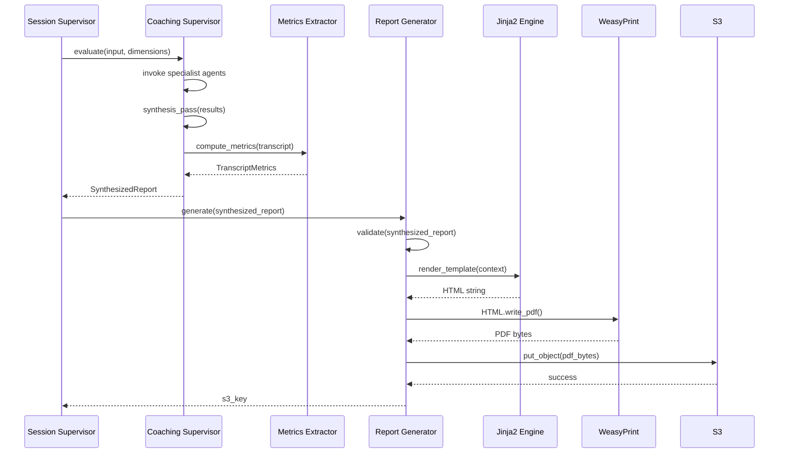
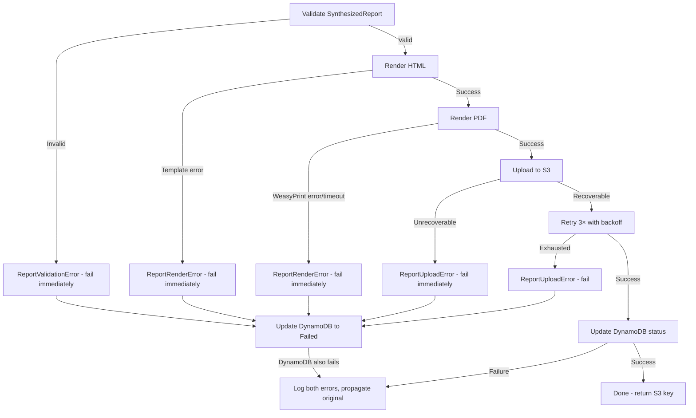

# Design Document: Coaching Report v2

## Overview

Coaching Report v2 replaces the existing ReportLab-based PDF generation pipeline with a WeasyPrint-based HTML/CSS-to-PDF system. The new pipeline introduces a **Coaching Supervisor synthesis pass** that collapses duplicate findings across specialist agents, ranks them globally by projected impact, and produces a structured `SynthesizedReport` data model. This model feeds a Jinja2 HTML template that WeasyPrint renders into a visually rich, 6+ page coaching PDF.

Key architectural changes:
- **Synthesis pass** added to the `CoachingSupervisor` after all specialist agents complete, producing a deduplicated, ranked, capped output
- **New data model** (`SynthesizedReport`) that acts as the single contract between the supervisor and the renderer
- **Transcript metrics extraction** as a pure-function computation from word-level timings
- **WeasyPrint + Jinja2** replaces ReportLab's imperative PDF building with declarative HTML/CSS
- **Docker container updates** to include WeasyPrint's native dependencies (cairo, pango, gdk-pixbuf, fonts)

The system retains the existing architecture patterns: Pydantic v2 models, S3 storage at `reports/{user_id}/{submission_id}/coaching_report.pdf`, and the workspace's error handling standards (fail-immediately for unrecoverable errors, exponential backoff with jitter for transient failures).

## Architecture

### High-Level System Flow

```mermaid
flowchart TD
    A[7 Specialist Agents] -->|EvaluationResult[]| B[Coaching Supervisor]
    B -->|Synthesis Pass| C[SynthesizedReport]
    T[Transcript + Word Timings] -->|Metrics Extraction| M[TranscriptMetrics]
    M --> C
    C -->|Template Context| D[Jinja2 Template Engine]
    D -->|HTML string| E[WeasyPrint Renderer]
    E -->|PDF bytes| F[S3 Upload]
    F --> G[reports/user_id/submission_id/coaching_report.pdf]
```

### Component Interaction Sequence



### Deployment Context

The Report Generator runs inside the existing `agentic-evaluation` ECS Fargate Spot container. The Dockerfile is extended with WeasyPrint's system dependencies. No new services or infrastructure are introduced — this is a component-level replacement within the existing service boundary.

## Components and Interfaces

### 1. Coaching Supervisor — Synthesis Pass Extension

**Location:** `src/agents/coaching_supervisor.py`

Extends the existing `CoachingSupervisor` class with a `synthesis_pass()` method called after `_direct_invoke_tools()` returns all `EvaluationResult` objects.

```python
class CoachingSupervisor:
    # ... existing methods ...

    def synthesis_pass(
        self,
        results: list[EvaluationResult],
        transcript: TranscriptData,
        metadata: SubmissionMetadata,
    ) -> SynthesizedReport:
        """Collapse duplicates, rank globally, generate coaching artifacts.

        Steps:
        1. Collapse duplicate findings (≥3 agents same category/behavior)
        2. Compute Projected_Impact_Score for each surviving finding
        3. Rank findings globally descending by impact
        4. Cap findings (5/dim), strengths (3/dim)
        5. Derive Three_Move_Plan from top 3 findings
        6. Generate Swap_Pairs (1/dim where evidence exists)
        7. Generate Practice_Drills (1/dim where findings exist)
        8. Compute transcript metrics
        9. Assemble SynthesizedReport
        """
        ...

    def _collapse_duplicates(
        self, results: list[EvaluationResult]
    ) -> list[SynthesizedFinding]:
        """Collapse findings raised by ≥3 agents for same behavior.

        Returns collapsed findings attributed to the dimension where
        the issue costs the most points, with cross-dimension impact note.
        """
        ...

    def _rank_findings(
        self, findings: list[SynthesizedFinding]
    ) -> list[SynthesizedFinding]:
        """Sort findings by Projected_Impact_Score descending."""
        ...

    def _apply_caps(
        self, findings_by_dim: dict[str, list[SynthesizedFinding]]
    ) -> dict[str, list[SynthesizedFinding]]:
        """Enforce 5-finding cap per dimension.

        Drop order: findings without evidence first, then lowest impact.
        """
        ...

    def _derive_three_moves(
        self, ranked_findings: list[SynthesizedFinding]
    ) -> list[ThreeMove]:
        """Extract top 3 findings as the Three_Move_Plan."""
        ...

    def _generate_swap_pairs(
        self, findings_by_dim: dict[str, list[SynthesizedFinding]]
    ) -> dict[str, SwapPair | None]:
        """Generate one swap pair per dimension where evidence ≥10 chars."""
        ...

    def _generate_practice_drills(
        self, findings_by_dim: dict[str, list[SynthesizedFinding]]
    ) -> dict[str, PracticeDrill | None]:
        """Generate one practice drill per dimension with findings."""
        ...
```

### 2. Transcript Metrics Extractor

**Location:** `src/services/transcript_metrics.py` (new file)

A pure-function module with no side effects. All computations are deterministic given the same input.

```python
@dataclass(frozen=True)
class WordTiming:
    word: str
    start_seconds: float
    end_seconds: float
    confidence: float | None


@dataclass(frozen=True)
class TranscriptData:
    words: list[WordTiming]
    close_start_seconds: float  # from Talk_Timeline segmentation


def compute_metrics(transcript: TranscriptData) -> TranscriptMetrics | None:
    """Compute all transcript metrics from word-level timings.

    Returns None if transcript has fewer than 2 words with timing data.
    Pure function — deterministic, no side effects.
    """
    ...


def _compute_speaking_rate_wpm(words: list[WordTiming], pauses: list[float]) -> int:
    """Total words / (total duration - pauses > 1s), rounded to nearest int."""
    ...


def _count_filler_words(words: list[WordTiming]) -> int:
    """Count uh, um, ah, er, and contextual 'like'."""
    ...


def _count_so_openers(words: list[WordTiming], pause_threshold: float = 1.0) -> int:
    """Count 'So' appearing after >1s pause or as first word."""
    ...


def _count_pauses(words: list[WordTiming], threshold: float = 1.0) -> int:
    """Count gaps between consecutive words exceeding threshold."""
    ...


def _compute_longest_unbroken_run(words: list[WordTiming], threshold: float = 1.0) -> float:
    """Max duration between two consecutive >1s pauses, rounded to 1 decimal."""
    ...


def _compute_close_share(transcript: TranscriptData) -> float:
    """Percentage of total audio in closing segment."""
    ...


def _compute_enunciation_confidence(words: list[WordTiming]) -> float:
    """Median of word-level confidence scores, excluding None."""
    ...
```

### 3. Report Generator (WeasyPrint)

**Location:** `src/services/report_generator.py` (replaces existing ReportLab implementation)

```python
class ReportGeneratorV2:
    """Renders SynthesizedReport to PDF via WeasyPrint + Jinja2.

    Replaces the old ReportLab-based ReportGenerator.
    """

    def __init__(
        self,
        bucket_name: str,
        template_path: str = "templates/coaching_report.html",
        s3_client: Any | None = None,
        timeout_seconds: float = 30.0,
    ) -> None:
        ...

    def generate(self, report: SynthesizedReport) -> str:
        """Validate, render, upload. Returns S3 key.

        Raises:
            ReportValidationError: If SynthesizedReport has invalid fields
            ReportRenderError: If Jinja2 or WeasyPrint fails (unrecoverable)
            ReportUploadError: If S3 upload fails after retries exhausted
        """
        self._validate(report)
        html = self._render_html(report)
        pdf_bytes = self._render_pdf(html)
        s3_key = self._upload(report, pdf_bytes)
        self._update_status(report, s3_key)
        return s3_key

    def _validate(self, report: SynthesizedReport) -> None:
        """Validate all required fields and ranges. Fail immediately if invalid."""
        ...

    def _render_html(self, report: SynthesizedReport) -> str:
        """Load Jinja2 template, render with report context dict."""
        ...

    def _render_pdf(self, html: str) -> bytes:
        """WeasyPrint HTML->PDF with 30s timeout. Unrecoverable on failure."""
        ...

    def _upload(self, report: SynthesizedReport, pdf_bytes: bytes) -> str:
        """S3 upload with retry (recoverable) and fail-fast (unrecoverable)."""
        ...

    def _update_status(self, report: SynthesizedReport, s3_key: str) -> None:
        """Update DynamoDB submission status."""
        ...
```

### 4. Jinja2 Template + CSS

**Location:** `src/templates/coaching_report.html`, `src/templates/coaching_report.css`

The template is a standard Jinja2 HTML document that:
- Uses `@page` CSS rules for US Letter sizing and page margins
- Defines page-specific layouts via CSS classes
- Generates SVG inline for gauge, dimension bars, timeline
- Uses CSS `break-inside: avoid` for findings
- Includes page footer with page numbers via `@bottom-center` CSS

Template filters registered in Python:
- `format_duration(seconds)` → "M min SS sec"
- `format_date(iso_string)` → "MONTH DAY, YEAR"
- `score_band_color(band)` → CSS color string
- `score_to_arc_degrees(score)` → SVG arc path data

### 5. Docker Container Updates

**Location:** `Dockerfile`

```dockerfile
FROM public.ecr.aws/docker/library/python:3.12-slim

WORKDIR /app

# WeasyPrint system dependencies
RUN apt-get update && apt-get install -y --no-install-recommends \
    libcairo2 \
    libpango-1.0-0 \
    libpangocairo-1.0-0 \
    libgdk-pixbuf2.0-0 \
    libffi-dev \
    shared-mime-info \
    fonts-dejavu-core \
    fonts-liberation \
    fonts-freefont-ttf \
    && rm -rf /var/lib/apt/lists/*

COPY requirements.txt .
RUN pip install --no-cache-dir -r requirements.txt

COPY src/ ./src/

ENV PYTHONPATH="/app/src"

# Startup verification: WeasyPrint can render minimal HTML
HEALTHCHECK --interval=30s --timeout=10s --retries=1 \
    CMD python -c "from weasyprint import HTML; HTML(string='<p>ok</p>').write_pdf()" || exit 1

CMD ["python", "-m", "deployment.local_runner"]
```

## Data Models

### SynthesizedReport (Pydantic v2)

```python
from datetime import datetime
from enum import Enum
from typing import Literal
from uuid import UUID

from pydantic import BaseModel, Field, field_validator, model_validator


class ScoreBand(str, Enum):
    DEVELOPING = "Developing"
    COMPETENT = "Competent"
    EFFECTIVE = "Effective"
    EXCEPTIONAL = "Exceptional"


class Severity(str, Enum):
    HIGH = "high"
    MEDIUM = "medium"
    LOW = "low"


class EffortTag(str, Enum):
    QUICK_WIN = "quick-win"
    MODERATE = "moderate"
    LONG_TERM = "long-term"


class ImpactTag(str, Enum):
    HIGH = "high"
    MEDIUM = "medium"
    LOW = "low"


class SynthesizedFinding(BaseModel):
    severity: Severity
    title: str = Field(..., max_length=80)
    explanation: str  # max 100 words enforced by validator
    suggestion: str  # max 80 words enforced by validator
    effort_tag: EffortTag
    impact_tag: ImpactTag
    evidence_quote: str | None = Field(default=None, max_length=200)
    evidence_timestamp_seconds: float | None = Field(default=None, ge=0.0)
    cross_dimension_note: str | None = Field(default=None, max_length=120)
    projected_impact_score: float = Field(..., ge=0.0, le=10.0)

    @field_validator("explanation")
    @classmethod
    def explanation_max_words(cls, v: str) -> str:
        if len(v.split()) > 100:
            raise ValueError("explanation must be 100 words or fewer")
        return v

    @field_validator("suggestion")
    @classmethod
    def suggestion_max_words(cls, v: str) -> str:
        if len(v.split()) > 80:
            raise ValueError("suggestion must be 80 words or fewer")
        return v


class SwapPair(BaseModel):
    you_said: str = Field(..., min_length=10, max_length=280)
    try_instead: str = Field(..., max_length=400)


class PracticeDrill(BaseModel):
    time_box_minutes: int = Field(..., ge=2, le=15)
    instructions: str = Field(..., min_length=50, max_length=500)


class SeverityCounts(BaseModel):
    high: int = Field(..., ge=0)
    medium: int = Field(..., ge=0)
    low: int = Field(..., ge=0)
    strength: int = Field(..., ge=0)


class DimensionEntry(BaseModel):
    dimension_name: str
    score: float = Field(..., ge=0.0, le=10.0)
    score_band: ScoreBand
    rank: int = Field(..., ge=1, le=7)
    one_sentence_verdict: str  # max 25 words
    severity_counts: SeverityCounts
    findings: list[SynthesizedFinding] = Field(..., max_length=5)
    strengths: list[str] = Field(..., max_length=3)
    swap_pair: SwapPair | None = None
    practice_drill: PracticeDrill | None = None
    is_weakest: bool = False

    @field_validator("one_sentence_verdict")
    @classmethod
    def verdict_max_words(cls, v: str) -> str:
        if len(v.split()) > 25:
            raise ValueError("one_sentence_verdict must be 25 words or fewer")
        return v


class ThreeMove(BaseModel):
    title: str = Field(..., max_length=60)
    coaching_advice: str  # max 150 words
    projected_impact_score: float = Field(..., ge=0.0, le=10.0)
    dimensions_lifted: list[str] = Field(..., min_length=1, max_length=7)

    @field_validator("coaching_advice")
    @classmethod
    def advice_max_words(cls, v: str) -> str:
        if len(v.split()) > 150:
            raise ValueError("coaching_advice must be 150 words or fewer")
        return v


class TimelinePin(BaseModel):
    timestamp_seconds: float = Field(..., ge=0.0)
    label: str = Field(..., max_length=60)
    severity: Severity
    dimension: str


class TalkTimeline(BaseModel):
    total_duration_seconds: float = Field(..., ge=0.0)
    open_percent: float = Field(..., ge=0.0, le=100.0)
    body_percent: float = Field(..., ge=0.0, le=100.0)
    close_percent: float = Field(..., ge=0.0, le=100.0)
    timeline_pins: list[TimelinePin] = Field(default_factory=list)

    @model_validator(mode="after")
    def percentages_sum_to_100(self) -> "TalkTimeline":
        total = self.open_percent + self.body_percent + self.close_percent
        if abs(total - 100.0) > 0.01:
            raise ValueError(
                f"open_percent + body_percent + close_percent must equal 100.0, got {total}"
            )
        return self


class TranscriptMetrics(BaseModel):
    speaking_rate_wpm: int = Field(..., ge=0)
    target_range_wpm: tuple[int, int]
    filler_word_count: int = Field(..., ge=0)
    so_opener_count: int = Field(..., ge=0)
    pauses_over_one_second: int = Field(..., ge=0)
    longest_unbroken_run_seconds: float = Field(..., ge=0.0)
    close_share_percent: float = Field(..., ge=0.0, le=100.0)
    enunciation_confidence: float = Field(..., ge=0.0, le=1.0)


class Provenance(BaseModel):
    report_id: str  # UUID string
    evaluator_release: str  # semver
    rubric_version: str  # semver
    prompt_set_version: str  # semver
    model_id: str
    model_temperature: float = Field(..., ge=0.0, le=2.0)
    transcription_service: str
    evaluation_window: str  # ISO 8601 duration
    run_completed_timestamp: str  # ISO 8601 UTC


class SynthesizedReport(BaseModel):
    # Submission metadata
    user_name: str = Field(..., max_length=100)
    presentation_title: str = Field(..., max_length=200)
    file_name: str = Field(..., max_length=255)
    upload_date: str  # ISO 8601 UTC
    audio_duration_seconds: float = Field(..., ge=0.0)
    report_id: str  # UUID string
    speaker_identified: bool

    # Scores
    overall_score: float = Field(..., ge=0.0, le=10.0)
    score_band: ScoreBand
    distance_to_next_band: float = Field(..., ge=0.0)

    # Narrative
    two_sentence_verdict: str  # max 80 words, exactly 2 sentences
    lede_paragraph: str  # max 120 words

    # Dimensions
    dimensions: list[DimensionEntry] = Field(..., min_length=7, max_length=7)

    # Three Moves
    three_moves: list[ThreeMove] = Field(..., min_length=3, max_length=3)
    strengths_to_protect: list[str] = Field(..., min_length=1, max_length=4)
    diagnosis_paragraph: str  # max 150 words

    # Metrics & Timeline
    transcript_metrics: TranscriptMetrics | None = None
    talk_timeline: TalkTimeline

    # Provenance
    provenance: Provenance

    @field_validator("two_sentence_verdict")
    @classmethod
    def verdict_constraints(cls, v: str) -> str:
        sentences = [s.strip() for s in v.split(".") if s.strip()]
        if len(v.split()) > 80:
            raise ValueError("two_sentence_verdict must be 80 words or fewer")
        return v

    @field_validator("lede_paragraph")
    @classmethod
    def lede_max_words(cls, v: str) -> str:
        if len(v.split()) > 120:
            raise ValueError("lede_paragraph must be 120 words or fewer")
        return v

    @field_validator("diagnosis_paragraph")
    @classmethod
    def diagnosis_max_words(cls, v: str) -> str:
        if len(v.split()) > 150:
            raise ValueError("diagnosis_paragraph must be 150 words or fewer")
        return v

    @model_validator(mode="after")
    def exactly_one_weakest(self) -> "SynthesizedReport":
        weakest_count = sum(1 for d in self.dimensions if d.is_weakest)
        if weakest_count != 1:
            raise ValueError(
                f"Exactly one dimension must have is_weakest=True, got {weakest_count}"
            )
        return self
```

### Score Band Classification Logic

```python
def classify_score_band(score: float) -> ScoreBand:
    """Classify a numeric score into a ScoreBand."""
    if score >= 8.5:
        return ScoreBand.EXCEPTIONAL
    elif score >= 6.5:
        return ScoreBand.EFFECTIVE
    elif score >= 4.0:
        return ScoreBand.COMPETENT
    else:
        return ScoreBand.DEVELOPING


def compute_distance_to_next_band(score: float) -> float:
    """Compute points needed to reach the next band boundary."""
    if score >= 8.5:
        return 0.0
    elif score >= 6.5:
        return round(8.5 - score, 2)
    elif score >= 4.0:
        return round(6.5 - score, 2)
    else:
        return round(4.0 - score, 2)
```

### Finding Drop Priority Algorithm

```python
def apply_findings_cap(
    findings: list[SynthesizedFinding], cap: int = 5
) -> list[SynthesizedFinding]:
    """Enforce per-dimension findings cap.

    Drop order:
    1. Findings without evidence (no timestamp AND no quote) — lowest impact first
    2. Remaining findings — lowest Projected_Impact_Score first

    Returns at most `cap` findings.
    """
    if len(findings) <= cap:
        return findings

    has_evidence = []
    no_evidence = []
    for f in findings:
        if f.evidence_quote or f.evidence_timestamp_seconds is not None:
            has_evidence.append(f)
        else:
            no_evidence.append(f)

    # Sort no-evidence by impact ascending (lowest dropped first)
    no_evidence.sort(key=lambda f: f.projected_impact_score)

    # Drop no-evidence findings until at cap or exhausted
    while len(has_evidence) + len(no_evidence) > cap and no_evidence:
        no_evidence.pop(0)

    # If still over cap, drop lowest-impact from has_evidence
    has_evidence.sort(key=lambda f: f.projected_impact_score)
    remaining = has_evidence + no_evidence
    remaining.sort(key=lambda f: f.projected_impact_score, reverse=True)

    return remaining[:cap]
```

### Filler Word Detection Algorithm

```python
# Core filler words (always counted)
ALWAYS_FILLERS = {"uh", "um", "ah", "er"}

# POS-based lookahead tags that disqualify "like" as filler
NON_FILLER_FOLLOWERS = {"NN", "NNS", "NNP", "JJ", "JJR", "JJS", "VB", "VBD", "VBG", "VBN", "VBP", "VBZ"}


def is_filler_like(word_index: int, words: list[WordTiming]) -> bool:
    """Determine if 'like' at word_index is a filler.

    'like' is a filler when:
    - Followed by a pause ≥ 0.2s before the next word, OR
    - NOT followed by a noun, adjective, or verb within the next 2 words
    """
    if word_index + 1 >= len(words):
        return True  # end of transcript — it's filler

    current = words[word_index]
    next_word = words[word_index + 1]

    # Check pause condition
    gap = next_word.start_seconds - current.end_seconds
    if gap >= 0.2:
        return True

    # Check next-2-word POS condition (simplified: use word heuristics
    # since full POS tagging is not available at this stage)
    # This is a heuristic approximation — check if following words
    # are common determiners/prepositions that suggest "like" is a verb/preposition
    return False  # conservative default; full impl uses POS heuristic lookup
```

## Correctness Properties

*A property is a characteristic or behavior that should hold true across all valid executions of a system — essentially, a formal statement about what the system should do. Properties serve as the bridge between human-readable specifications and machine-verifiable correctness guarantees.*

### Property 1: Synthesis produces valid output from any valid evaluation results

*For any* list of 1 to 7 valid `EvaluationResult` objects (simulating partial or complete specialist agent returns), the `synthesis_pass()` function SHALL produce a valid `SynthesizedReport` that passes Pydantic validation, with the number of populated dimension entries equal to the number of input results.

**Validates: Requirements 1.1, 1.13**

### Property 2: Duplicate collapse merges same-category findings with impact note

*For any* set of `EvaluationResult` objects where 3 or more dimensions contain findings with the same `category` field, the `_collapse_duplicates()` function SHALL produce exactly one surviving finding for that category, attributed to the dimension where the corresponding score is lowest (highest cost), and the collapsed finding SHALL have a non-null `cross_dimension_note` of at most 120 characters identifying the other affected dimensions.

**Validates: Requirements 1.2, 1.3**

### Property 3: Global ranking is sorted descending by Projected Impact Score

*For any* list of `SynthesizedFinding` objects produced by the synthesis pass, the `_rank_findings()` function SHALL return them in strictly non-increasing order of `projected_impact_score`.

**Validates: Requirements 1.4**

### Property 4: Three Move Plan derives from the top-3 ranked findings

*For any* globally-ranked findings list of length ≥ 3, the `three_moves` list in the `SynthesizedReport` SHALL contain entries whose `projected_impact_score` values correspond to the three highest `projected_impact_score` values in the ranked findings list, in descending order.

**Validates: Requirements 1.5**

### Property 5: Per-dimension caps are enforced

*For any* `SynthesizedReport`, every `DimensionEntry` SHALL have at most 5 findings and at most 3 strengths.

**Validates: Requirements 1.6, 1.7**

### Property 6: Finding drop priority preserves evidence over impact

*For any* list of `SynthesizedFinding` objects exceeding the per-dimension cap of 5, applying `apply_findings_cap()` SHALL drop findings without evidence (no `evidence_quote` and no `evidence_timestamp_seconds`) before dropping findings with evidence, and within each group, findings with lower `projected_impact_score` SHALL be dropped first. The surviving list SHALL have length ≤ 5, and every finding in the surviving list SHALL have a `projected_impact_score` ≥ any finding that was dropped from the same evidence-group.

**Validates: Requirements 1.10**

### Property 7: Score band classification and distance-to-next-band are consistent

*For any* float `score` in [0.0, 10.0], `classify_score_band(score)` SHALL return Developing when score < 4.0, Competent when 4.0 ≤ score < 6.5, Effective when 6.5 ≤ score < 8.5, and Exceptional when score ≥ 8.5. Furthermore, `compute_distance_to_next_band(score)` SHALL return the positive difference to the next boundary, or 0.0 for Exceptional.

**Validates: Requirements 2.3, 2.4**

### Property 8: SynthesizedReport model rejects invalid field values

*For any* `SynthesizedReport` input where one or more fields violate their constraints (score outside [0.0, 10.0], word counts exceeding limits, missing required fields, or dimension count ≠ 7), Pydantic validation SHALL raise a `ValidationError` identifying each invalid field.

**Validates: Requirements 2.14, 2.15**

### Property 9: Speaking rate WPM computed correctly

*For any* `TranscriptData` with ≥ 2 words, `_compute_speaking_rate_wpm()` SHALL return `round(total_word_count / net_speaking_minutes)` where `net_speaking_minutes` = (elapsed time from first word start to last word end, minus the sum of all pause durations exceeding 1.0 second) / 60. The result SHALL be a non-negative integer.

**Validates: Requirements 3.1, 3.10**

### Property 10: Pause count equals number of inter-word gaps exceeding 1 second

*For any* `TranscriptData` with ≥ 2 words, `_count_pauses()` SHALL return the exact count of consecutive word pairs where `words[i+1].start_seconds - words[i].end_seconds > 1.0`.

**Validates: Requirements 3.4**

### Property 11: Longest unbroken run is the maximum segment between pauses

*For any* `TranscriptData` with ≥ 2 words, `_compute_longest_unbroken_run()` SHALL return the maximum duration among all segments bounded by >1s pauses (treating transcript start and end as boundaries), rounded to 1 decimal place.

**Validates: Requirements 3.5, 3.11**

### Property 12: Enunciation confidence is the median of word confidence scores

*For any* `TranscriptData` where at least one word has a non-null `confidence` value, `_compute_enunciation_confidence()` SHALL return the statistical median of all non-null confidence values, with words having null confidence excluded from the computation.

**Validates: Requirements 3.7**

### Property 13: Transcript metrics computation is deterministic

*For any* `TranscriptData`, calling `compute_metrics()` twice with identical input SHALL produce identical `TranscriptMetrics` output (all fields equal).

**Validates: Requirements 3.8**

### Property 14: PDF page count in valid range for complete reports

*For any* valid `SynthesizedReport` with all 7 dimensions populated, the rendered PDF SHALL contain between 6 and 20 pages inclusive.

**Validates: Requirements 4.4**

### Property 15: PDF page ordering follows specification

*For any* valid `SynthesizedReport`, the rendered PDF pages SHALL contain section markers in this order: Scorecard content appears before Three Moves content, which appears before Dimension Card content, which appears before Progress content, which appears before "How this was scored" content.

**Validates: Requirements 4.3**

### Property 16: Swap pair presence follows evidence rule

*For any* dimension in a `SynthesizedReport`, `swap_pair` SHALL be non-null if and only if that dimension has at least one finding with an `evidence_quote` of 10 or more characters. When `swap_pair` is non-null, the `you_said` field SHALL be between 10 and 280 characters.

**Validates: Requirements 11.1, 11.4**

### Property 17: Practice drill presence follows findings rule

*For any* dimension in a `SynthesizedReport`, `practice_drill` SHALL be non-null if and only if that dimension has at least one finding. When non-null, `time_box_minutes` SHALL be in [2, 15] and `instructions` SHALL be between 50 and 500 characters.

**Validates: Requirements 12.1, 12.4**

### Property 18: Coaching prose uses second-person voice and excludes speaker identity

*For any* `SynthesizedReport` with a known `user_name`, the coaching prose fields (two_sentence_verdict, lede_paragraph, diagnosis_paragraph, all finding explanations, suggestions, drill instructions, and swap pair try_instead fields) SHALL contain at least one second-person pronoun ("you" or "your") in aggregate, and SHALL NOT contain the `user_name` string.

**Validates: Requirements 15.1, 15.2**

## Error Handling

Error handling follows the workspace's error handling standards: distinguish unrecoverable from recoverable errors, never retry what cannot succeed.

### Unrecoverable Errors (Fail Immediately)

| Error | Source | Action |
|-------|--------|--------|
| SynthesizedReport validation failure | `_validate()` | Return `ReportValidationError` listing all invalid fields. Do not render. |
| Jinja2 template missing or syntax error | `_render_html()` | Return `ReportRenderError` with template path and error location. Do not upload. |
| WeasyPrint rendering exception | `_render_pdf()` | Log full error context (report_id, exception). Return `ReportRenderError`. No retry. |
| Rendering timeout (>30s) | `_render_pdf()` | Terminate rendering, log timeout with report_id. Return `ReportRenderError`. No retry. |
| S3 AccessDenied / BucketNotFound / InvalidCredentials | `_upload()` | Return `ReportUploadError` immediately. No retry. |
| DynamoDB access denied / table not found | `_update_status()` | Log both original failure and DynamoDB error. Propagate original error. |

### Recoverable Errors (Retry with Exponential Backoff + Jitter)

| Error | Source | Retry Strategy |
|-------|--------|----------------|
| S3 ThrottlingException / ServiceUnavailable / Timeout | `_upload()` | 3 attempts, base delay 1s, backoff 2×, FULL jitter |
| DynamoDB throttling (status update) | `_update_status()` | 3 attempts, base delay 1s, backoff 2×, FULL jitter |

### Error Propagation Flow



### Custom Exception Hierarchy

```python
class ReportError(Exception):
    """Base for all report generation errors."""
    def __init__(self, report_id: str, message: str):
        self.report_id = report_id
        super().__init__(f"[{report_id}] {message}")


class ReportValidationError(ReportError):
    """SynthesizedReport failed validation. Unrecoverable."""
    def __init__(self, report_id: str, invalid_fields: list[str]):
        self.invalid_fields = invalid_fields
        super().__init__(report_id, f"Validation failed: {', '.join(invalid_fields)}")


class ReportRenderError(ReportError):
    """Template or WeasyPrint rendering failed. Unrecoverable."""
    pass


class ReportUploadError(ReportError):
    """S3 upload failed after retries exhausted."""
    pass
```

## Testing Strategy

### Dual Testing Approach

This feature uses both **property-based tests** (Hypothesis) and **example-based unit tests** to achieve comprehensive coverage:

- **Property-based tests**: Verify universal properties across randomized inputs (transcript metrics, data model validation, synthesis logic, cap enforcement, drop priority)
- **Unit tests**: Verify specific examples, edge cases, error handling paths, and integration points (template rendering, S3 upload, DynamoDB updates)

### Property-Based Testing Configuration

- **Library**: [Hypothesis](https://hypothesis.readthedocs.io/) (already in `requirements-dev.txt`)
- **Minimum iterations**: 100 per property (configured in `pyproject.toml` `[tool.hypothesis] max_examples = 100`)
- **Test location**: `tests/properties/test_coaching_report_v2_properties.py`
- **Tag format**: `# Feature: coaching-report-v2, Property {N}: {property_text}`

Each of the 18 correctness properties maps to a single property-based test function.

### Test File Organization

```
tests/
├── properties/
│   └── test_coaching_report_v2_properties.py   # All 18 PBT properties
├── unit/
│   ├── test_transcript_metrics.py              # Example-based edge cases for metrics
│   ├── test_synthesized_report_model.py        # Boundary validation examples
│   ├── test_report_generator_v2.py             # Render/upload error handling
│   └── test_synthesis_pass.py                  # Specific synthesis scenarios
└── integration/
    └── test_report_generation_e2e.py           # End-to-end with mocked AWS
```

### Key Test Strategies by Component

| Component | Property Tests | Unit Tests | Integration Tests |
|-----------|---------------|------------|-------------------|
| Transcript Metrics | Props 9–13 (pure functions) | Edge cases: <2 words, all-pause transcript, single word | — |
| Synthesis Pass | Props 1–6, 16–17 | Specific collapse scenarios, cap edge cases | — |
| Score Classification | Prop 7 | Boundary values (4.0, 6.5, 8.5 exact) | — |
| Data Model | Prop 8 | Null fields, out-of-range, missing dimensions | — |
| PDF Rendering | Props 14–15 | Template error, timeout, WeasyPrint failure | Full render with valid report |
| Voice Consistency | Prop 18 | Specific name-leak scenarios | — |
| S3 Upload | — | Retry behavior, fail-fast for AccessDenied | Upload with moto |
| Error Handling | — | Each error path from Error Handling section | End-to-end failure flow |

### Hypothesis Strategies (Generators)

Key custom strategies needed for property tests:

```python
# Word timings with realistic ranges
word_timing_st = st.builds(
    WordTiming,
    word=st.text(min_size=1, max_size=20, alphabet=st.characters(whitelist_categories=("L",))),
    start_seconds=st.floats(min_value=0.0, max_value=3600.0),
    end_seconds=st.floats(min_value=0.0, max_value=3600.0),
    confidence=st.one_of(st.none(), st.floats(min_value=0.0, max_value=1.0)),
)

# Transcript with valid ordering (start < end, monotonic)
@composite
def valid_transcript(draw, min_words=2, max_words=200):
    ...

# Valid SynthesizedReport with all constraints satisfied
@composite
def valid_synthesized_report(draw):
    ...

# Invalid SynthesizedReport with specific field violations
@composite
def invalid_synthesized_report(draw):
    ...
```

### What Is NOT Tested with PBT

- **LLM-generated text quality** (semantic correctness of coaching advice, swap pair intent preservation) — requires human review
- **Visual rendering fidelity** (CSS spacing, color correctness, SVG appearance) — requires visual regression tests
- **Docker container startup** — smoke test only
- **S3/DynamoDB integration** — moto-based integration tests with specific examples

