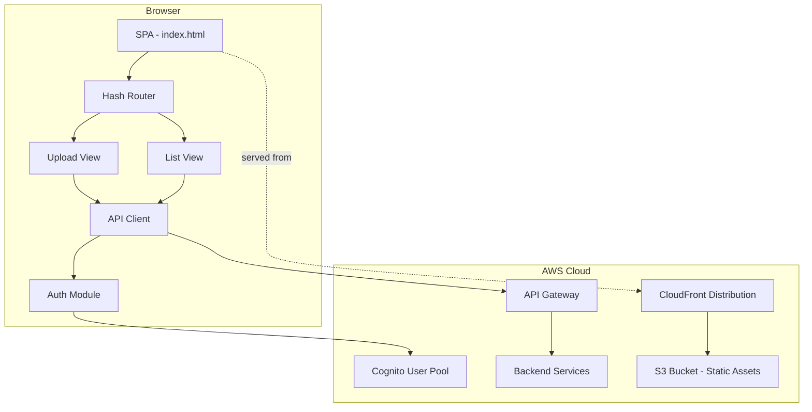
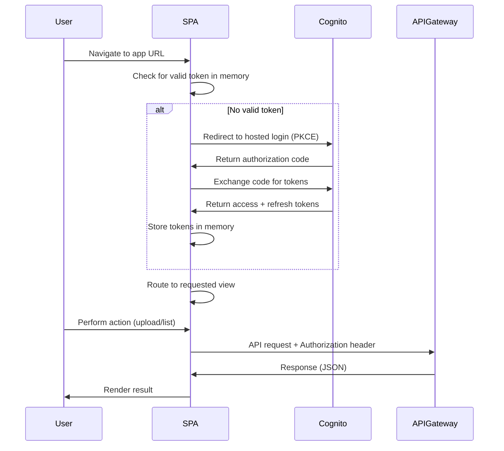

# Design Document: Frontend SPA

## Overview

The Frontend SPA is a lightweight, vanilla JavaScript single-page application for the Presentation Coaching Platform. It provides two primary views — an Upload Page and a List View — connected by a client-side hash router. The application is hosted as static assets on S3 and delivered via CloudFront, with authentication delegated to AWS Cognito's hosted UI.

The design avoids heavy frameworks (React, Vue, Angular) in favor of plain HTML, CSS, and ES modules. This keeps the bundle small, eliminates build tooling dependencies, and aligns with the static hosting model. The tradeoff is that DOM manipulation is manual, but given only two views and moderate interactivity, this is manageable.

### Key Design Decisions

| Decision | Choice | Rationale |
|----------|--------|-----------|
| Framework | None (vanilla JS + ES modules) | Two views, minimal state; a framework adds complexity without proportional benefit |
| Routing | Hash-based client-side router | Works with S3 static hosting without CloudFront rewrite rules |
| Authentication | Cognito Hosted UI + Authorization Code flow with PKCE | Keeps credentials off the client; tokens in memory only |
| CSS Architecture | CSS custom properties in a single theme file | Meets requirement 9 for centralized branding |
| Build tooling | None for MVP | Static hosting; files served directly; can add bundler later |

---

## Architecture



### Request Flow



---

## Components and Interfaces

### Module Structure

```
webapp/
├── index.html              # Shell HTML with semantic structure
├── css/
│   ├── theme.css           # CSS custom properties (brand tokens)
│   ├── layout.css          # Responsive grid, navigation, structure
│   └── components.css      # Reusable component styles (buttons, forms, cards)
├── js/
│   ├── app.js              # Entry point, initializes router and auth
│   ├── router.js           # Hash-based client-side router
│   ├── auth.js             # Cognito auth (PKCE flow, token management)
│   ├── api.js              # API client (fetch wrapper with auth headers)
│   ├── views/
│   │   ├── upload.js       # Upload page view (file selection, metadata, submission)
│   │   └── list.js         # List view (submissions display, report access)
│   └── utils/
│       ├── validation.js   # Input validation functions
│       └── dom.js          # DOM helper utilities
└── assets/
    └── icons/              # SVG icons for UI elements
```

### Component Interfaces

#### Router (`router.js`)

```javascript
/**
 * Hash-based SPA router.
 * Routes map hash fragments to view render functions.
 */
export class Router {
  /**
   * @param {Object<string, Function>} routes - Map of hash paths to render functions
   * @param {HTMLElement} outlet - DOM element where views render
   */
  constructor(routes, outlet) {}

  /** Start listening to hashchange events and render initial route */
  start() {}

  /** Navigate programmatically to a route */
  navigate(path) {}
}
```

#### Auth Module (`auth.js`)

```javascript
/**
 * Manages Cognito authentication with PKCE flow.
 * Tokens are held in module-scoped variables (memory only).
 */
export const auth = {
  /** Redirect to Cognito hosted UI if no valid session */
  login() {},

  /** Exchange authorization code for tokens */
  handleCallback(code) {},

  /** Return current valid access token, refreshing if expired */
  async getAccessToken() {},

  /** Clear tokens from memory, redirect to Cognito logout */
  logout() {},

  /** Check if user has a valid (non-expired) session */
  isAuthenticated() {},
};
```

#### API Client (`api.js`)

```javascript
/**
 * Centralized HTTP client for API Gateway communication.
 * Automatically attaches Authorization header and handles errors.
 */
export const api = {
  /**
   * Upload a file with metadata.
   * @param {File} file - The presentation file
   * @param {Object} metadata - { title: string, description?: string }
   * @param {Function} onProgress - Callback with upload percentage (0-100)
   * @returns {Promise<Object>} API response
   */
  async uploadSubmission(file, metadata, onProgress) {},

  /**
   * Retrieve list of user submissions.
   * @returns {Promise<Array<Submission>>} Sorted submissions
   */
  async getSubmissions() {},

  /**
   * Get report URL for a completed submission.
   * @param {string} submissionId
   * @returns {Promise<string>} Report URL
   */
  async getReportUrl(submissionId) {},
};
```

#### Validation (`validation.js`)

```javascript
/**
 * Pure validation functions for upload form inputs.
 */

/**
 * Validate a selected file against type and size constraints.
 * @param {File} file
 * @returns {{ valid: boolean, error?: string }}
 */
export function validateFile(file) {}

/**
 * Validate presentation title.
 * @param {string} title
 * @returns {{ valid: boolean, error?: string }}
 */
export function validateTitle(title) {}

/**
 * Validate presentation description.
 * @param {string} description
 * @returns {{ valid: boolean, error?: string }}
 */
export function validateDescription(description) {}
```

---

## Data Models

### Submission

```javascript
/**
 * @typedef {Object} Submission
 * @property {string} id - Unique submission identifier
 * @property {string} title - Presentation title
 * @property {string} fileName - Original uploaded file name
 * @property {string} [description] - Optional presentation description
 * @property {string} dateUploaded - ISO 8601 date string
 * @property {ProcessingStatus} status - Current processing status
 * @property {string} [dateCompleted] - ISO 8601 date string, present when status is Completed
 * @property {string} [reportUrl] - URL to the generated report, present when status is Completed
 */
```

### ProcessingStatus

```javascript
/**
 * @typedef {'Pending' | 'Processing' | 'Completed' | 'Failed'} ProcessingStatus
 */
```

### AuthState (in-memory only)

```javascript
/**
 * @typedef {Object} AuthState
 * @property {string|null} accessToken - Current JWT access token
 * @property {string|null} refreshToken - Current refresh token
 * @property {number|null} expiresAt - Token expiry timestamp (ms since epoch)
 */
```

### Upload Form State

```javascript
/**
 * @typedef {Object} UploadFormState
 * @property {File|null} selectedFile - Currently selected file
 * @property {string} title - Presentation title input value
 * @property {string} description - Description textarea value
 * @property {boolean} isUploading - Whether upload is in progress
 * @property {number} uploadProgress - Upload percentage (0-100)
 * @property {Object} errors - Validation errors keyed by field name
 */
```

### Accepted File Types

| Category | Extensions | MIME Types |
|----------|-----------|------------|
| Audio | .mp3, .wav, .m4a, .aac | audio/mpeg, audio/wav, audio/x-m4a, audio/aac |
| Video | .mp4, .mov, .webm | video/mp4, video/quicktime, video/webm |

### Validation Constants

```javascript
const VALIDATION = {
  MAX_FILE_SIZE_BYTES: 500 * 1024 * 1024, // 500 MB
  MAX_TITLE_LENGTH: 200,
  MAX_DESCRIPTION_LENGTH: 2000,
  ACCEPTED_AUDIO_TYPES: ['audio/mpeg', 'audio/wav', 'audio/x-m4a', 'audio/aac'],
  ACCEPTED_VIDEO_TYPES: ['video/mp4', 'video/quicktime', 'video/webm'],
};
```

---


## Correctness Properties

*A property is a characteristic or behavior that should hold true across all valid executions of a system — essentially, a formal statement about what the system should do. Properties serve as the bridge between human-readable specifications and machine-verifiable correctness guarantees.*

### Property 1: Client-side routing renders correct view

*For any* registered route hash in the router configuration, navigating to that hash should render the corresponding view function's output into the router outlet element, and no full page reload should occur.

**Validates: Requirements 1.3**

### Property 2: Authenticated API requests include Authorization header

*For any* API request made through the API client while a user session is active, the request should include an `Authorization: Bearer <token>` header containing the current valid access token.

**Validates: Requirements 2.6**

### Property 3: File validation correctness

*For any* file, `validateFile` should return `{ valid: true }` if and only if the file's MIME type is in the accepted audio/video type list AND the file size is less than or equal to 500 MB. For any file that fails either condition, it should return `{ valid: false }` with an appropriate error message.

**Validates: Requirements 3.3, 3.4**

### Property 4: File selection displays file information

*For any* file with any name and any size, selecting it via the file input should result in the file's name and human-readable formatted size being displayed in the upload form.

**Validates: Requirements 3.2**

### Property 5: Title validation

*For any* non-empty string of length 1 to 200 characters, `validateTitle` should return `{ valid: true }`. For any empty string or whitespace-only string, or any string exceeding 200 characters, `validateTitle` should return `{ valid: false }` with an appropriate error message.

**Validates: Requirements 4.1, 4.3**

### Property 6: Description validation

*For any* string of length 0 to 2000 characters (including empty string), `validateDescription` should return `{ valid: true }`. For any string exceeding 2000 characters, `validateDescription` should return `{ valid: false }` with an appropriate error message.

**Validates: Requirements 4.2**

### Property 7: Submission rendering includes all required fields

*For any* valid Submission object, the rendered HTML for that submission should contain the presentation title, uploaded file name, description, date uploaded, processing status, and date of processing completion (when present).

**Validates: Requirements 6.2**

### Property 8: Submissions sorted by date descending

*For any* array of Submission objects with varying dateUploaded values, the List View should render them in descending order by dateUploaded (most recent first).

**Validates: Requirements 6.3**

### Property 9: Report link displayed iff status is Completed

*For any* Submission, the rendered list item should display a report link if and only if the submission's Processing_Status is "Completed". For any submission with status "Pending", "Processing", or "Failed", no report link should be rendered.

**Validates: Requirements 7.1, 7.3**

### Property 10: API requests with body include JSON content-type

*For any* API request made through the API client that includes a request body, the request should include a `Content-Type: application/json` header.

**Validates: Requirements 8.2**

### Property 11: Error responses produce user-friendly messages

*For any* HTTP error response (status 4xx or 5xx) with any response body, the API client's error handling should produce a user-friendly error message string that does not contain raw stack traces, exception class names, or internal server details.

**Validates: Requirements 8.3**

---

## Error Handling

### Authentication Errors

| Scenario | Behavior |
|----------|----------|
| No valid session on app load | Redirect to Cognito hosted login |
| Access token expired | Silently refresh using refresh token |
| Refresh token expired/invalid | Redirect to Cognito login |
| 401 response from API | Attempt token refresh + retry once; if still 401, redirect to login |
| Cognito callback error | Display login error, offer retry link |

### Upload Errors

| Scenario | Behavior |
|----------|----------|
| Invalid file type selected | Display inline error listing accepted formats; disable submit |
| File too large (>500 MB) | Display inline error with max size; disable submit |
| Empty title on submit | Display validation error on title field; prevent submit |
| Network failure during upload | Display "Network unavailable" message with retry button |
| API returns 4xx during upload | Display user-friendly error message; re-enable submit for retry |
| API returns 5xx during upload | Display "Server error, please try again later"; re-enable submit |

### List View Errors

| Scenario | Behavior |
|----------|----------|
| Network failure loading submissions | Display "Network unavailable" message with retry button |
| API returns error loading list | Display user-friendly error with retry option |
| Empty submissions list | Display empty state message with link to Upload Page |

### Global Error Handling

- All unhandled promise rejections are caught by a global handler that displays a generic error toast
- API client wraps all fetch calls in try/catch to handle network errors separately from HTTP errors
- Error messages are never raw technical details — the API client maps status codes to human-readable strings

---

## Testing Strategy

### Testing Approach

The testing strategy employs a dual approach:

1. **Property-based tests** — Verify universal correctness properties across many generated inputs using a PBT library
2. **Unit tests** — Verify specific examples, edge cases, and integration points with concrete scenarios

### Property-Based Testing

**Library:** [fast-check](https://github.com/dubzzz/fast-check) (JavaScript PBT library)

**Configuration:**
- Minimum 100 iterations per property test
- Each property test references its design document property via tag comment

**Tag format:** `// Feature: frontend-spa, Property {number}: {property_text}`

**Properties to implement:**
- Property 1: Router renders correct view for any registered route
- Property 2: API client attaches Authorization header to all requests
- Property 3: File validation accepts valid files and rejects invalid ones
- Property 4: File selection displays name/size for any file
- Property 5: Title validation accepts valid titles, rejects invalid ones
- Property 6: Description validation accepts valid descriptions, rejects invalid ones
- Property 7: Submission rendering includes all fields for any submission
- Property 8: Submission list sorted descending by date for any input array
- Property 9: Report link shown iff status is Completed for any submission
- Property 10: API requests with body include JSON content-type
- Property 11: Error responses produce user-friendly messages for any error code/body

### Unit Tests (Example-Based)

**Focus areas:**
- Authentication flow: login redirect, token exchange, logout
- Upload submission: progress events, button disable during upload, success navigation
- UI interactions: character count display, maxlength enforcement, hamburger menu toggle
- Accessibility: ARIA labels present, focus indicators, semantic structure
- Edge cases: empty submission list, network failures, 401 retry logic

### Integration Tests

**Focus areas:**
- Full upload flow: file selection → metadata entry → submit → API call → success navigation
- List view data loading: API call → render submissions → report link click
- Auth flow end-to-end: redirect to Cognito → callback → token stored → authenticated request
- Responsive layout at breakpoints (320px, 768px, 1024px)

### Test Structure

```
webapp/
├── tests/
│   ├── properties/
│   │   ├── validation.property.test.js   # Properties 3, 5, 6
│   │   ├── router.property.test.js       # Property 1
│   │   ├── api.property.test.js          # Properties 2, 10, 11
│   │   └── listview.property.test.js     # Properties 7, 8, 9
│   ├── unit/
│   │   ├── auth.test.js
│   │   ├── upload.test.js
│   │   └── list.test.js
│   └── integration/
│       ├── upload-flow.test.js
│       └── list-flow.test.js
```

### Test Runner

- **Vitest** for running tests (fast, ES module native, no heavy config)
- **fast-check** for property-based test generation
- **jsdom** environment for DOM testing without a browser
