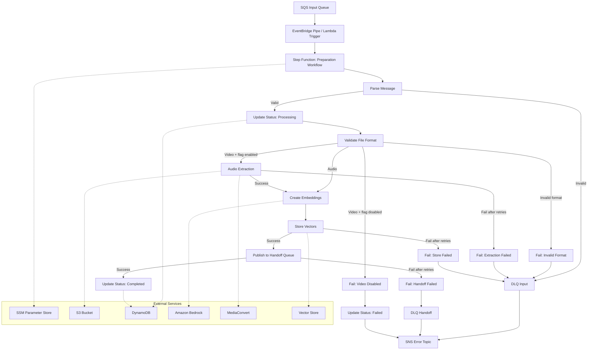

# Design Document: Preparation Workflow

## Overview

The Preparation Workflow is an AWS Step Functions Standard Workflow that acts as the processing backbone of the Presentation Coaching Platform. It consumes SQS messages produced by the Upload and Storage service, validates uploaded files against supported formats, optionally extracts audio from video files using AWS Elemental MediaConvert, creates vector embeddings from audio content using Amazon Bedrock (Nova Multimodal Embeddings), and hands off processed results to the Agentic Processing work unit via a FIFO SQS queue.

The Standard Workflow type is chosen over Express Workflow because:
- Embedding operations may exceed the 5-minute Express Workflow limit
- Standard Workflows provide built-in execution history and audit trail
- Native retry with backoff/jitter is supported at the state level

All processing parameters (model selection, chunking strategy, retry counts, feature flags) are externalized to AWS Systems Manager Parameter Store to enable runtime reconfiguration without redeployment.

## Architecture



### Key Architectural Decisions

| Decision | Choice | Rationale |
|----------|--------|-----------|
| Workflow type | Standard (not Express) | Embedding may take >5 min; need execution history |
| Trigger mechanism | EventBridge Pipe from SQS to Step Functions | Native integration, no Lambda needed for trigger |
| Audio extraction | AWS Elemental MediaConvert | Cost-effective, AWS-native, no server management |
| Embedding model | Amazon Nova Multimodal Embeddings (via Bedrock) | Multi-modal, multilingual, direct audio input |
| Configuration store | AWS Systems Manager Parameter Store | Runtime updates without redeployment, versioned, IAM-secured |
| Vector store | Configurable (initially S3-based or Amazon OpenSearch Serverless) | Allows evaluation; endpoint read from SSM |
| Handoff mechanism | FIFO SQS queue | Preserves order, loose coupling, independent scaling |
| Error routing | DLQ + SNS notifications | No silent failures; operational visibility |

## Components and Interfaces

### 1. Step Function State Machine

The state machine orchestrates the entire workflow with the following states:

| State | Type | Purpose |
|-------|------|---------|
| LoadConfig | Task (Lambda) | Read all parameters from SSM Parameter Store |
| ParseMessage | Task (Lambda) | Parse and validate SQS message body |
| UpdateStatusProcessing | Task (DynamoDB SDK) | Set processing_status = "Processing" |
| ValidateFileFormat | Task (Lambda) | Check file extension/MIME against allowed types |
| CheckVideoFlag | Choice | Branch on Feature_Flag_Video_Processing |
| ExtractAudio | Task (Lambda → MediaConvert) | Submit and poll MediaConvert job |
| ChunkAudio | Task (Lambda) | Divide audio into chunks per strategy |
| CreateEmbeddings | Map (Lambda) | Process chunks in parallel/batch via Bedrock |
| StoreVectors | Task (Lambda) | Write embeddings to Vector Store |
| PublishHandoff | Task (SQS SDK) | Send message to FIFO Handoff Queue |
| UpdateStatusCompleted | Task (DynamoDB SDK) | Set processing_status = "Completed" |
| HandleFailure | Task (Lambda) | Update DynamoDB to Failed, publish SNS, route to DLQ |

### 2. Lambda Functions

| Function | Responsibility |
|----------|---------------|
| `load_config` | Fetch SSM parameters: model ID, chunk size, overlap, max retries, video flag, vector store config, batch size |
| `parse_message` | Deserialize SQS body into validated Pydantic model |
| `validate_format` | Validate file extension against accepted audio/video formats |
| `extract_audio` | Submit MediaConvert job, poll for completion, return output S3 key |
| `chunk_audio` | Download audio, split into chunks based on configured strategy, upload chunks to S3 |
| `create_embedding` | Invoke Bedrock with audio chunk, return embedding vector |
| `store_vectors` | Write embedding + metadata to configured Vector Store |
| `publish_handoff` | Construct and send FIFO message to SQS Handoff Queue |
| `handle_failure` | Update DynamoDB status, send DLQ message, publish SNS notification |

### 3. Infrastructure Components

| Component | Configuration |
|-----------|---------------|
| SQS Input Queue | Standard queue, 3 max receive count → DLQ |
| SQS Handoff Queue | FIFO queue with DLQ |
| DLQ Input | Standard queue for failed input messages |
| DLQ Handoff | FIFO queue for failed handoff messages |
| SNS Topic | Error notifications, threshold alerts |
| DynamoDB Table | Shared submissions table (from Upload Service) |
| S3 Bucket | Shared uploads bucket (from Upload Service) |
| SSM Parameter Store | `/prescoach/{env}/preparation-workflow/*` namespace |

### 4. Interfaces

#### Input: SQS Message Body (from Upload Service)

```json
{
  "submission_id": "string",
  "user_id": "string",
  "s3_bucket": "string",
  "s3_file_key": "string",
  "original_file_name": "string",
  "presentation_title": "string"
}
```

#### Output: Handoff Message Body (to Agentic Processing)

```json
{
  "submission_id": "string",
  "user_id": "string",
  "s3_file_key": "string",
  "vector_store_location": "string",
  "chunk_count": 0,
  "presentation_title": "string"
}
```

#### SNS Error Notification

```json
{
  "submission_id": "string",
  "step_name": "string",
  "error_type": "string",
  "error_message": "string",
  "retry_count_exhausted": 0,
  "timestamp": "2024-01-01T00:00:00Z"
}
```

#### SSM Parameter Paths

| Path | Type | Description |
|------|------|-------------|
| `/prescoach/{env}/preparation-workflow/embedding-model-id` | String | Bedrock model identifier |
| `/prescoach/{env}/preparation-workflow/chunk-size-seconds` | String | Audio chunk duration in seconds |
| `/prescoach/{env}/preparation-workflow/chunk-overlap-seconds` | String | Overlap between consecutive chunks |
| `/prescoach/{env}/preparation-workflow/max-retry-attempts` | String | Maximum retry count for service calls |
| `/prescoach/{env}/preparation-workflow/video-processing-enabled` | String | "true" or "false" feature flag |
| `/prescoach/{env}/preparation-workflow/vector-store-endpoint` | String | Vector store connection endpoint |
| `/prescoach/{env}/preparation-workflow/vector-store-type` | String | Vector store type (s3, opensearch, etc.) |
| `/prescoach/{env}/preparation-workflow/batch-size` | String | Number of chunks per batch embedding call |
| `/prescoach/{env}/preparation-workflow/batch-processing-enabled` | String | "true" or "false" batch mode flag |

## Data Models

### WorkflowConfig (loaded from SSM at start)

```python
from pydantic import BaseModel

class WorkflowConfig(BaseModel):
    embedding_model_id: str
    chunk_size_seconds: int
    chunk_overlap_seconds: int
    max_retry_attempts: int
    video_processing_enabled: bool
    vector_store_endpoint: str
    vector_store_type: str
    batch_size: int
    batch_processing_enabled: bool
```

### InputMessage (SQS body from Upload Service)

```python
from pydantic import BaseModel

class InputMessage(BaseModel):
    submission_id: str
    user_id: str
    s3_bucket: str
    s3_file_key: str
    original_file_name: str
    presentation_title: str
```

### HandoffMessage (published to FIFO Handoff Queue)

```python
from pydantic import BaseModel

class HandoffMessage(BaseModel):
    submission_id: str
    user_id: str
    s3_file_key: str
    vector_store_location: str
    chunk_count: int
    presentation_title: str
```

### AudioChunk (intermediate representation)

```python
from pydantic import BaseModel

class AudioChunk(BaseModel):
    chunk_index: int
    s3_chunk_key: str
    timestamp_start_seconds: float
    timestamp_end_seconds: float
    submission_id: str
    user_id: str
```

### EmbeddingResult (returned from Bedrock invocation)

```python
from pydantic import BaseModel
from typing import List

class EmbeddingResult(BaseModel):
    submission_id: str
    user_id: str
    chunk_index: int
    chunk_timestamp_start: float
    chunk_timestamp_end: float
    embedding_vector: List[float]
    embedding_model_version: str
```

### VectorMetadata (stored alongside embedding)

```python
from pydantic import BaseModel

class VectorMetadata(BaseModel):
    submission_id: str
    user_id: str
    chunk_index: int
    chunk_timestamp_start: float
    chunk_timestamp_end: float
    embedding_model_version: str
```

### ErrorNotification (published to SNS)

```python
from pydantic import BaseModel

class WorkflowErrorNotification(BaseModel):
    submission_id: str
    step_name: str
    error_type: str
    error_message: str
    retry_count_exhausted: int
    timestamp: str  # ISO 8601
    queue_name: str | None = None
```

### FileValidationResult

```python
from pydantic import BaseModel
from typing import Optional

class FileValidationResult(BaseModel):
    valid: bool
    file_type: str | None = None  # "audio" or "video"
    error: str | None = None
```

### Processing Status Updates

The workflow uses the existing `ProcessingStatus` enum from the upload service:
- `Pending` → `Processing` (on workflow start)
- `Processing` → `Completed` (on success)
- `Processing` → `Failed` (on unrecoverable error)


## Correctness Properties

*A property is a characteristic or behavior that should hold true across all valid executions of a system — essentially, a formal statement about what the system should do. Properties serve as the bridge between human-readable specifications and machine-verifiable correctness guarantees.*

### Property 1: Message Parsing Round-Trip

*For any* valid InputMessage with arbitrary string values for submission_id, user_id, s3_bucket, s3_file_key, original_file_name, and presentation_title, serializing the message to JSON and then deserializing it back SHALL produce an identical InputMessage with all fields preserved exactly.

**Validates: Requirements 1.2**

### Property 2: Invalid Message Rejection

*For any* JSON object that is missing one or more required fields (submission_id, user_id, s3_file_key, original_file_name, presentation_title), the parse_message function SHALL reject the input and return an error result rather than a valid InputMessage.

**Validates: Requirements 1.4**

### Property 3: File Format Validation Biconditional

*For any* filename string, the validate_format function SHALL return valid=True if and only if the file extension (case-insensitive) is one of the accepted extensions (.mp3, .wav, .m4a, .aac, .mp4, .mov, .webm). Additionally, when valid, the file_type field SHALL be "audio" for audio extensions and "video" for video extensions.

**Validates: Requirements 2.1**

### Property 4: Video Processing Decision

*For any* file classification result and feature flag state, the processing decision function SHALL: (a) proceed to embedding when the file is audio regardless of flag state, (b) proceed to audio extraction when the file is video and the flag is enabled, and (c) fail with a descriptive reason when the file is video and the flag is disabled.

**Validates: Requirements 2.3, 2.4**

### Property 5: Audio Output Path Construction

*For any* valid user_id and submission_id strings, the constructed audio output S3 key SHALL match the pattern `processed/{user_id}/{submission_id}/audio.{format}` where the user_id and submission_id values in the path are exactly the input values.

**Validates: Requirements 3.2**

### Property 6: Audio Chunking Correctness

*For any* audio duration (> 0), chunk size (> 0), and overlap (>= 0, < chunk_size), the chunk_audio function SHALL produce chunks where: (a) the first chunk starts at timestamp 0, (b) the last chunk ends at or after the total audio duration, (c) consecutive chunks overlap by exactly the configured overlap amount, and (d) no audio content is skipped between chunks.

**Validates: Requirements 4.3**

### Property 7: Vector Metadata Completeness

*For any* valid submission_id, user_id, chunk_index, chunk_timestamp_start, chunk_timestamp_end, and embedding_model_version, the constructed VectorMetadata SHALL contain all six fields with values matching the inputs exactly.

**Validates: Requirements 4.4, 11.3**

### Property 8: Error Notification Completeness

*For any* failure context with submission_id, step_name, error_type, error_message, retry_count_exhausted, and timestamp, the constructed WorkflowErrorNotification SHALL contain all required fields, and the timestamp SHALL be in valid ISO 8601 format.

**Validates: Requirements 6.4, 9.2**

### Property 9: Handoff Message Completeness

*For any* valid processing result with submission_id, user_id, s3_file_key, vector_store_location, chunk_count (>= 1), and presentation_title, the constructed HandoffMessage SHALL contain all six fields with values matching the inputs exactly.

**Validates: Requirements 7.3**

### Property 10: Batch Grouping Correctness

*For any* list of audio chunks (length >= 1) and batch_size (>= 1), when batch processing is enabled, the batch grouping function SHALL produce exactly ceil(len(chunks) / batch_size) batches, each batch SHALL contain at most batch_size chunks, all chunks SHALL appear in exactly one batch, and chunk order SHALL be preserved.

**Validates: Requirements 10.1, 10.2**

## Error Handling

### Retry Strategy

All AWS service interactions use exponential backoff with jitter:

| Service | Initial Interval | Backoff Rate | Max Attempts (default) |
|---------|-----------------|--------------|------------------------|
| MediaConvert | 30s | 2.0 | 3 |
| Bedrock (embedding) | 5s | 2.0 | 3 |
| Vector Store write | 2s | 2.0 | 3 |
| SQS Handoff publish | 2s | 2.0 | 3 |
| DynamoDB update | 1s | 2.0 | 3 |

Max attempts are read from SSM Parameter Store at workflow start. Jitter is applied using the `FULL` jitter strategy (random value between 0 and computed backoff).

### Failure Handling Flow

1. **Transient failures** (throttling, timeouts): Handled by Step Functions native retry with backoff/jitter
2. **Permanent failures** (invalid format, missing file): Immediately fail without retry
3. **Exhausted retries**: Route to appropriate DLQ, update DynamoDB to Failed, publish SNS notification
4. **SNS publish failure**: Caught and logged but does NOT fail the workflow (best-effort notification)

### Dead-Letter Queue Strategy

| DLQ | Source | Purpose |
|-----|--------|---------|
| DLQ_Input | SQS_Input_Queue, Workflow failures | Messages that couldn't be processed after all retries |
| DLQ_Handoff | SQS_Handoff_Queue | Messages that couldn't be delivered to Agentic Processing |

### CloudWatch Alarms

- DLQ message count threshold alarm → publishes to SNS_Topic
- Configurable threshold via SSM parameter

## Testing Strategy

### Property-Based Tests (Hypothesis)

Property-based tests validate the pure logic layer of the preparation workflow using the [Hypothesis](https://hypothesis.readthedocs.io/) library (already in use by the upload-service). Each property test runs a minimum of 100 iterations.

| Property | Module Under Test | Tag |
|----------|-------------------|-----|
| Property 1: Message Parsing Round-Trip | `src/models/input_message.py` | `Feature: preparation-workflow, Property 1: Message parsing round-trip` |
| Property 2: Invalid Message Rejection | `src/handlers/parse_message.py` | `Feature: preparation-workflow, Property 2: Invalid message rejection` |
| Property 3: File Format Validation | `src/validation/format_validator.py` | `Feature: preparation-workflow, Property 3: File format validation biconditional` |
| Property 4: Video Processing Decision | `src/handlers/validate_format.py` | `Feature: preparation-workflow, Property 4: Video processing decision` |
| Property 5: Audio Output Path | `src/services/audio_extraction.py` | `Feature: preparation-workflow, Property 5: Audio output path construction` |
| Property 6: Audio Chunking | `src/services/chunking.py` | `Feature: preparation-workflow, Property 6: Audio chunking correctness` |
| Property 7: Vector Metadata | `src/models/embedding_result.py` | `Feature: preparation-workflow, Property 7: Vector metadata completeness` |
| Property 8: Error Notification | `src/models/error_notification.py` | `Feature: preparation-workflow, Property 8: Error notification completeness` |
| Property 9: Handoff Message | `src/models/handoff_message.py` | `Feature: preparation-workflow, Property 9: Handoff message completeness` |
| Property 10: Batch Grouping | `src/services/batch_processor.py` | `Feature: preparation-workflow, Property 10: Batch grouping correctness` |

Configuration:
- Library: `hypothesis>=6.90.0`
- Settings: `max_examples=100`, `deadline=500`
- Location: `tests/properties/`

### Unit Tests (pytest)

Unit tests cover specific examples, edge cases, and integration points:

| Area | Examples |
|------|----------|
| Config loading | SSM parameter parsing, missing params, type coercion |
| Format validation | Case-insensitive extensions, filenames with multiple dots |
| Chunking edge cases | Audio shorter than chunk size, exact multiple of chunk size |
| Error handling | SNS publish failure doesn't propagate, DLQ routing on various failure types |
| Batch processing | Single chunk, batch_size=1, batch_size > chunk_count |

Location: `tests/unit/`

### Integration Tests (moto + pytest)

Integration tests use `moto` to mock AWS services and verify end-to-end workflow behavior:

| Scenario | Services Mocked |
|----------|----------------|
| Successful audio processing | SQS, DynamoDB, S3, SSM |
| Successful video processing | SQS, DynamoDB, S3, SSM, MediaConvert |
| Invalid format rejection | SQS, DynamoDB, SNS |
| Video disabled rejection | SQS, DynamoDB, SSM |
| Embedding failure after retries | SQS, DynamoDB, SNS, Bedrock |
| Handoff publish failure | SQS, DynamoDB, SNS |
| DLQ threshold alarm | CloudWatch, SNS |

Location: `tests/integration/`

### CDK Snapshot Tests

Infrastructure definitions are validated using CDK assertion utilities:

- Standard Workflow type verification
- Retry configuration on all task states
- DLQ associations
- IAM permissions (least privilege)
- SSM parameter paths

Location: `tests/cdk/`
