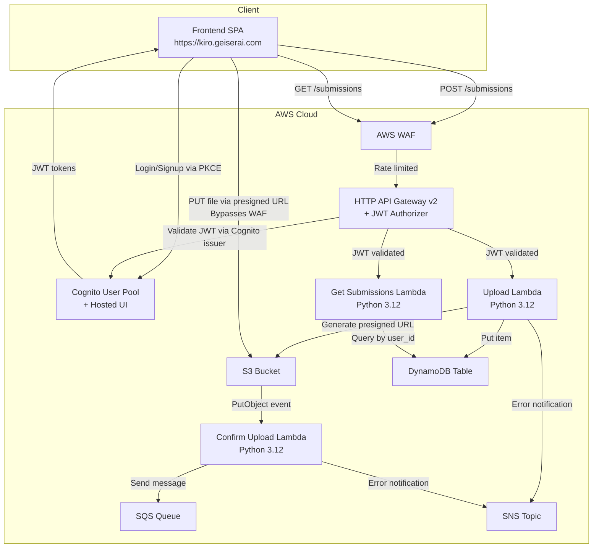
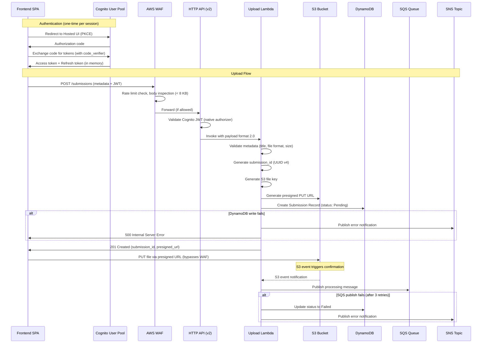
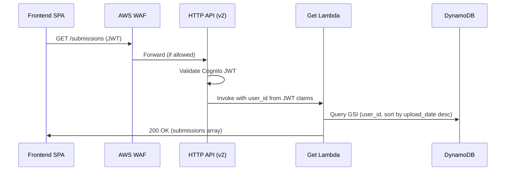
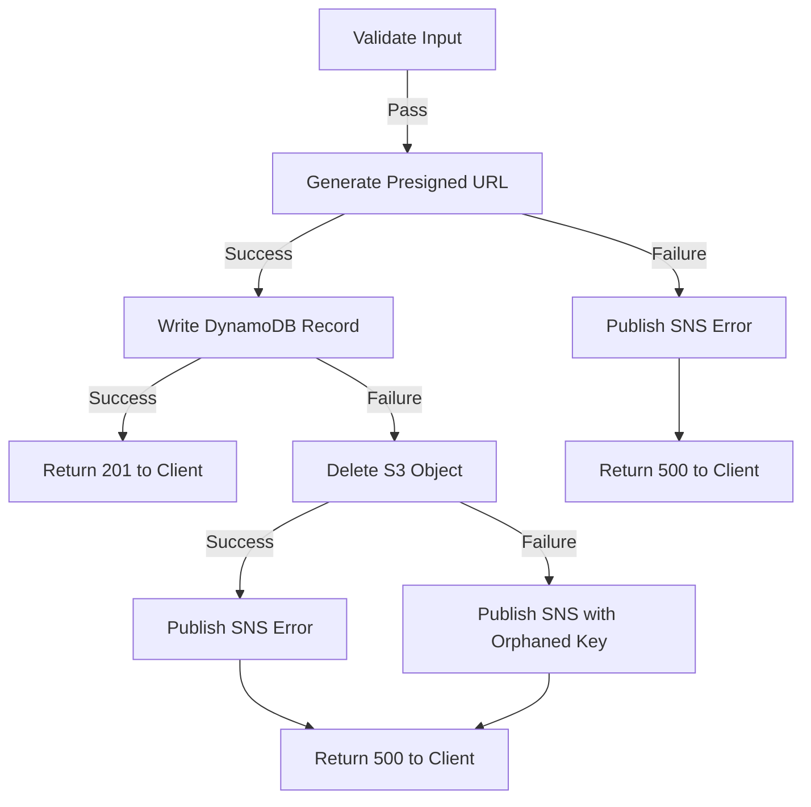

# Design Document: Upload and Storage Service

## Overview

The Upload and Storage service is the backend component of the Presentation Coaching Platform that receives presentation files via API Gateway, validates inputs, stores files in S3, persists metadata in DynamoDB, and publishes messages to SQS to trigger downstream processing. Error conditions are reported to SNS for operational visibility.

The service is implemented as AWS Lambda functions (Python 3.12) fronted by HTTP API (API Gateway v2) with a native JWT authorizer configured for Cognito. It exposes two endpoints:
- **POST /submissions** — Initiate a file upload (returns presigned S3 URL)
- **GET /submissions** — Retrieve submissions for the authenticated user

The frontend is served via a CloudFront distribution at `https://kiro.geiserai.com` which has AWS WAF enabled. The presigned URL approach ensures large file uploads bypass WAF inspection (direct S3 PUT), while API requests remain protected by WAF rate limiting and body inspection rules.

### Key Design Decisions

| Decision | Choice | Rationale |
|----------|--------|-----------|
| Runtime | Python 3.12 Lambda | Mature AWS SDK (boto3), strong data validation ecosystem (pydantic), excellent PBT support (hypothesis) |
| Framework | Minimal handler (no Flask/FastAPI) | Two endpoints; a framework adds unnecessary overhead in Lambda |
| File Upload | Presigned S3 URLs | Supports files up to 500 MB; bypasses WAF body inspection limits (8 KB default) and API Gateway payload limits |
| API Gateway | HTTP API (v2) | Native JWT authorizer for Cognito, payload format 2.0, lower cost, simpler route structure |
| WAF Compatibility | Presigned URL approach | Direct S3 uploads bypass WAF; API metadata requests stay under WAF's 8 KB body inspection limit |
| CORS | CloudFront origin allow-listed | `https://kiro.geiserai.com` configured as allowed origin for cross-origin requests |
| DynamoDB Mode | On-demand (PAY_PER_REQUEST) | Scales automatically; no capacity planning for MVP through Production |
| Compensation | Saga pattern (manual rollback) | No distributed transaction support; explicit compensating actions maintain consistency |
| ID Generation | UUID v4 | Standard, collision-resistant, no coordination required |
| IaC | AWS CDK (Python) | Type-safe infrastructure definitions; aligns with Lambda runtime |
| Data Validation | Pydantic v2 | Declarative validation with clear error messages; serialization support |
| Authentication | Cognito User Pool + PKCE | Managed sign-up/sign-in, hosted UI, JWT issuance; no credentials on client |

### Cognito Authentication Design

The service provisions and owns the Cognito User Pool as part of its CDK stack. This co-locates the auth configuration with the API that enforces it.

**User Pool Configuration:**
- **Pool name:** `PresentationCoaching-Users`
- **Sign-in alias:** Email
- **Self sign-up:** Enabled (users register themselves)
- **Auto-verify:** Email (verification code sent on registration)
- **Password policy:** Minimum 8 characters; require uppercase, lowercase, numbers, symbols
- **MFA:** Optional (TOTP)
- **Account recovery:** Email-based

**App Client Configuration:**
- **Client name:** `presentation-coaching-spa`
- **Client secret:** None (public client — required for PKCE)
- **OAuth 2.0 flows:** Authorization Code Grant with PKCE
- **Scopes:** `openid`, `profile`, `email`
- **Callback URLs:** `https://kiro.geiserai.com`, `http://localhost:5500`
- **Logout URLs:** `https://kiro.geiserai.com`, `http://localhost:5500`
- **Token validity:** Access token 1 hour, Refresh token 30 days, ID token 1 hour

**Hosted UI Domain:**
- **Prefix:** `presentation-coaching` (yields `https://presentation-coaching.auth.{region}.amazoncognito.com`)

**JWT Authorizer Integration:**
- HTTP API Gateway v2 uses native JWT authorizer
- Issuer URL: `https://cognito-idp.{region}.amazonaws.com/{user_pool_id}`
- Audience: App Client ID
- The `sub` claim from the validated JWT provides the `user_id` for all downstream operations

**CDK Outputs (for frontend configuration):**
- `CognitoUserPoolId` — User Pool ID
- `CognitoAppClientId` — App Client ID
- `CognitoDomain` — Full hosted UI domain URL
- `ApiEndpoint` — HTTP API Gateway endpoint URL

### WAF Considerations

The CloudFront distribution (`https://kiro.geiserai.com`) has AWS WAF enabled with:
- **Rate limiting rules** on the upload endpoint — the service returns appropriate 429 responses when rate-limited
- **Body inspection limit** of 8 KB by default — the presigned URL approach ensures the POST /submissions request body contains only metadata (well under 8 KB), while the actual file upload goes directly to S3, bypassing WAF entirely
- **CORS headers** — the API must return proper CORS headers allowing `https://kiro.geiserai.com` as an origin
- **Presigned S3 URLs** work with WAF because the client uploads directly to the S3 bucket endpoint, not through CloudFront/WAF

### Scaling Note: File Size Strategy

The 500 MB maximum file size exceeds API Gateway's 10 MB payload limit. The design uses presigned S3 upload URLs:
1. Client calls POST /submissions with metadata only (< 8 KB, safe for WAF inspection)
2. Lambda validates metadata, generates presigned PUT URL, creates DynamoDB record
3. Client uploads file directly to S3 using the presigned URL (bypasses WAF and API Gateway)
4. S3 event notification triggers confirmation Lambda for SQS publishing

---

## Architecture



### Upload Flow (Sequence)



### Retrieval Flow



---

## Components and Interfaces

### Project Structure

```
upload-service/
├── cdk/
│   ├── upload_service/
│   │   ├── cognito_construct.py       # Cognito User Pool, App Client, Hosted UI Domain
│   │   └── upload_service_stack.py    # CDK infrastructure definition
│   └── app.py                          # CDK app entry point
├── src/
│   ├── handlers/
│   │   ├── __init__.py
│   │   ├── upload.py                   # POST /submissions handler
│   │   ├── confirm_upload.py           # S3 event / confirmation handler
│   │   └── get_submissions.py          # GET /submissions handler
│   ├── services/
│   │   ├── __init__.py
│   │   ├── s3_service.py              # S3 operations (presigned URL, delete)
│   │   ├── dynamo_service.py          # DynamoDB operations (put, query, update)
│   │   ├── sqs_service.py            # SQS message publishing with retry
│   │   └── sns_service.py            # SNS error notification publishing
│   ├── models/
│   │   ├── __init__.py
│   │   ├── submission.py              # Submission record pydantic model
│   │   └── sqs_message.py            # SQS message body pydantic model
│   ├── validation/
│   │   ├── __init__.py
│   │   ├── file_validator.py          # File type and size validation
│   │   └── metadata_validator.py      # Metadata field validation
│   ├── utils/
│   │   ├── __init__.py
│   │   ├── file_key_generator.py      # S3 key generation logic
│   │   ├── error_response.py          # Standardized error response builder
│   │   └── id_generator.py           # UUID generation wrapper
│   └── types.py                        # Shared type definitions
├── tests/
│   ├── properties/
│   │   ├── test_validation_props.py
│   │   ├── test_file_key_props.py
│   │   ├── test_submission_props.py
│   │   └── test_error_response_props.py
│   ├── unit/
│   │   ├── test_upload_handler.py
│   │   ├── test_get_submissions_handler.py
│   │   └── services/
│   │       ├── test_s3_service.py
│   │       ├── test_dynamo_service.py
│   │       └── test_sqs_service.py
│   └── integration/
│       └── test_upload_flow.py
├── requirements.txt
├── requirements-dev.txt
└── pyproject.toml
```

### Handler Interfaces

#### Upload Handler (`handlers/upload.py`)

```python
from typing import Any


def handler(event: dict[str, Any], context: Any) -> dict[str, Any]:
    """
    Handles POST /submissions requests (HTTP API payload format 2.0).
    Validates metadata, generates presigned S3 URL, creates DynamoDB record.
    Returns submission_id and presigned upload URL to the client.

    Extracts user_id from event["requestContext"]["authorizer"]["jwt"]["claims"]["sub"].
    """
    ...
```

#### Get Submissions Handler (`handlers/get_submissions.py`)

```python
from typing import Any


def handler(event: dict[str, Any], context: Any) -> dict[str, Any]:
    """
    Handles GET /submissions requests (HTTP API payload format 2.0).
    Queries DynamoDB for all submissions belonging to the authenticated user.
    Returns submissions sorted by upload_date descending.
    """
    ...
```

#### Confirm Upload Handler (`handlers/confirm_upload.py`)

```python
from typing import Any


def handler(event: dict[str, Any], context: Any) -> None:
    """
    Triggered by S3 PutObject event when client completes file upload.
    Publishes SQS message to trigger downstream processing.
    Handles retry logic and failure compensation.
    """
    ...
```

### Service Interfaces

#### S3 Service (`services/s3_service.py`)

```python
from typing import Protocol


class S3ServiceProtocol(Protocol):
    def generate_presigned_upload_url(
        self, file_key: str, content_type: str, expires_in_seconds: int = 3600
    ) -> str:
        """Generate a presigned PUT URL for client-side upload."""
        ...

    def delete_object(self, file_key: str) -> None:
        """Delete an object from S3 (compensating action)."""
        ...
```

#### DynamoDB Service (`services/dynamo_service.py`)

```python
from typing import Protocol

from src.models.submission import SubmissionRecord


class DynamoServiceProtocol(Protocol):
    def create_submission(self, record: SubmissionRecord) -> None:
        """Create a new submission record."""
        ...

    def get_submissions_by_user(self, user_id: str) -> list[SubmissionRecord]:
        """Query submissions by user_id, sorted by upload_date desc."""
        ...

    def update_status(
        self, submission_id: str, status: str, **additional_fields: str | None
    ) -> None:
        """Update submission processing status."""
        ...
```

#### SQS Service (`services/sqs_service.py`)

```python
from typing import Protocol

from src.models.sqs_message import SqsMessageBody


class SqsServiceProtocol(Protocol):
    def publish_message(self, message: SqsMessageBody, max_retries: int = 3) -> None:
        """
        Publish a processing message to the queue.
        Retries up to max_retries times with exponential backoff on failure.
        """
        ...
```

#### SNS Service (`services/sns_service.py`)

```python
from typing import Protocol

from src.models.submission import ErrorNotification


class SnsServiceProtocol(Protocol):
    def publish_error_notification(self, notification: ErrorNotification) -> None:
        """
        Publish an error notification (best-effort, does not raise).
        """
        ...
```

### Validation Interfaces

#### File Validator (`validation/file_validator.py`)

```python
from dataclasses import dataclass


@dataclass
class FileValidationInput:
    file_name: str
    content_type: str
    file_size_bytes: int


@dataclass
class ValidationResult:
    valid: bool
    error: str | None = None


def validate_file(input_data: FileValidationInput) -> ValidationResult:
    """Validate file type and size constraints."""
    ...
```

#### Metadata Validator (`validation/metadata_validator.py`)

```python
from dataclasses import dataclass


@dataclass
class MetadataInput:
    presentation_title: str | None = None
    description: str | None = None
    original_file_name: str | None = None


@dataclass
class FieldError:
    field: str
    message: str


@dataclass
class MetadataValidationResult:
    valid: bool
    errors: list[FieldError]


def validate_metadata(input_data: MetadataInput) -> MetadataValidationResult:
    """Validate required and optional metadata fields."""
    ...
```

### Utility Interfaces

#### File Key Generator (`utils/file_key_generator.py`)

```python
def generate_file_key(user_id: str, submission_id: str, original_file_name: str) -> str:
    """
    Generate an S3 file key following the naming convention:
    uploads/{user_id}/{submission_id}/{original_filename}
    """
    ...
```

#### Error Response Builder (`utils/error_response.py`)

```python
from typing import Any


def build_error_response(
    status_code: int, code: str, message: str, correlation_id: str
) -> dict[str, Any]:
    """
    Build a standardized HTTP API error response.
    Returns dict with statusCode, headers (including CORS), and JSON body.
    """
    ...
```

### CORS Configuration

All API responses include CORS headers allowing the CloudFront distribution origin:

```python
CORS_HEADERS = {
    "Access-Control-Allow-Origin": "https://kiro.geiserai.com",
    "Access-Control-Allow-Methods": "GET, POST, OPTIONS",
    "Access-Control-Allow-Headers": "Content-Type, Authorization",
    "Access-Control-Max-Age": "86400",
}
```

The HTTP API (v2) is configured with built-in CORS support:

```python
cors = apigwv2.CorsPreflightOptions(
    allow_origins=["https://kiro.geiserai.com"],
    allow_methods=[apigwv2.CorsHttpMethod.GET, apigwv2.CorsHttpMethod.POST],
    allow_headers=["Content-Type", "Authorization"],
    max_age=Duration.days(1),
)
```

---

## Data Models

### DynamoDB Table Design

**Table Name:** `PresentationCoaching-Submissions`

| Attribute | Type | Key | Description |
|-----------|------|-----|-------------|
| submission_id | String | Partition Key | UUID v4 identifier |
| user_id | String | GSI-PK | Cognito user sub |
| upload_date | String | GSI-SK | ISO 8601 timestamp |
| original_file_name | String | — | Original uploaded file name |
| presentation_title | String | — | User-provided title |
| description | String | — | Optional description |
| s3_file_key | String | — | Full S3 object key |
| content_type | String | — | File MIME type |
| file_size_bytes | Number | — | File size in bytes |
| processing_status | String | — | Pending / Processing / Completed / Failed |
| completion_date | String | — | ISO 8601, null until completed |
| report_link | String | — | URL to report, null until completed |

**Global Secondary Index (GSI):**
- **Name:** `user-uploads-index`
- **Partition Key:** `user_id`
- **Sort Key:** `upload_date`
- **Projection:** ALL

### Pydantic Models

```python
from datetime import datetime
from enum import Enum
from typing import Optional

from pydantic import BaseModel, Field


class ProcessingStatus(str, Enum):
    PENDING = "Pending"
    PROCESSING = "Processing"
    COMPLETED = "Completed"
    FAILED = "Failed"


class SubmissionRecord(BaseModel):
    submission_id: str
    user_id: str
    original_file_name: str
    presentation_title: str
    description: Optional[str] = None
    s3_file_key: str
    content_type: str
    file_size_bytes: int
    upload_date: str  # ISO 8601
    processing_status: ProcessingStatus = ProcessingStatus.PENDING
    completion_date: Optional[str] = None
    report_link: Optional[str] = None
```

### SQS Message Body

```python
from pydantic import BaseModel


class SqsMessageBody(BaseModel):
    submission_id: str
    user_id: str
    s3_file_key: str
    original_file_name: str
    presentation_title: str
```

### SNS Error Notification

```python
from enum import Enum
from typing import Optional

from pydantic import BaseModel


class ErrorType(str, Enum):
    S3_WRITE_FAILURE = "S3_WRITE_FAILURE"
    DYNAMO_WRITE_FAILURE = "DYNAMO_WRITE_FAILURE"
    SQS_PUBLISH_FAILURE = "SQS_PUBLISH_FAILURE"
    S3_COMPENSATION_FAILURE = "S3_COMPENSATION_FAILURE"


class ErrorNotification(BaseModel):
    submission_id: Optional[str] = None
    error_type: ErrorType
    error_message: str
    timestamp: str  # ISO 8601
    service_component: str
    orphaned_s3_key: Optional[str] = None  # Present for compensation failures
```

### API Response Models

#### Success Response (POST /submissions)

```python
from pydantic import BaseModel


class UploadSuccessResponse(BaseModel):
    submission_id: str
    presigned_url: str
    processing_status: str = "Pending"
```

#### Success Response (GET /submissions)

```python
from pydantic import BaseModel

from src.models.submission import SubmissionRecord


class GetSubmissionsResponse(BaseModel):
    submissions: list[SubmissionRecord]
```

#### Error Response (all endpoints)

```python
from pydantic import BaseModel


class ErrorDetail(BaseModel):
    code: str
    message: str
    correlation_id: str


class ApiErrorResponse(BaseModel):
    error: ErrorDetail
```

### Accepted File Types

```python
ACCEPTED_CONTENT_TYPES: dict[str, list[str]] = {
    "audio": ["audio/mpeg", "audio/wav", "audio/x-m4a", "audio/aac"],
    "video": ["video/mp4", "video/quicktime", "video/webm"],
}

ACCEPTED_EXTENSIONS: list[str] = [".mp3", ".wav", ".m4a", ".aac", ".mp4", ".mov", ".webm"]

MAX_FILE_SIZE_BYTES: int = 500 * 1024 * 1024  # 500 MB
```

---

## Correctness Properties

*A property is a characteristic or behavior that should hold true across all valid executions of a system — essentially, a formal statement about what the system should do. Properties serve as the bridge between human-readable specifications and machine-verifiable correctness guarantees.*

### Property 1: File validation correctness

*For any* file metadata (content type and size), `validate_file` should return `ValidationResult(valid=True)` if and only if the content type is in the accepted audio/video type list AND the file size is less than or equal to 500 MB. For any file that fails either condition, it should return `ValidationResult(valid=False)` with an error message specifying the constraint violated.

**Validates: Requirements 1.3, 1.4, 1.5**

### Property 2: Metadata validation correctness

*For any* metadata input object, `validate_metadata` should return `MetadataValidationResult(valid=True)` if and only if `presentation_title` is a non-empty, non-whitespace string and `original_file_name` is present. For any input missing a required field or containing only whitespace for the title, it should return `MetadataValidationResult(valid=False)` with errors identifying each invalid field.

**Validates: Requirements 1.2, 1.6**

### Property 3: User ID extraction from JWT claims

*For any* HTTP API v2 event containing JWT authorizer claims, the handler should extract the user identifier from `event["requestContext"]["authorizer"]["jwt"]["claims"]["sub"]` and use it as the `user_id` for all downstream operations. The extracted user_id should always be a non-empty string matching the claim value exactly.

**Validates: Requirements 2.4**

### Property 4: File key generation follows naming convention

*For any* valid (user_id, submission_id, original_file_name) tuple, `generate_file_key` should produce a string matching the pattern `uploads/{user_id}/{submission_id}/{original_file_name}` exactly. Additionally, the original file extension should be preserved — the generated key's file extension should equal the input file's extension.

**Validates: Requirements 3.2, 3.3**

### Property 5: Submission record construction

*For any* valid set of upload inputs (user_id, file_name, title, description, file_key, content_type, file_size), the constructed `SubmissionRecord` should contain all required attributes with: `submission_id` matching UUID v4 format, `processing_status` set to "Pending", `completion_date` set to None, `report_link` set to None, and `upload_date` as a valid ISO 8601 timestamp.

**Validates: Requirements 4.2, 4.3**

### Property 6: SQS message body construction

*For any* valid submission data, the constructed `SqsMessageBody` should contain exactly the fields `submission_id`, `user_id`, `s3_file_key`, `original_file_name`, and `presentation_title`, with each value matching the corresponding input data.

**Validates: Requirements 5.2**

### Property 7: Error response format consistency

*For any* error scenario (any HTTP status code, error code string, message string, and correlation ID), `build_error_response` should produce a response body containing exactly the fields `error.code`, `error.message`, and `error.correlation_id` with values matching the inputs. The response should never contain stack traces, internal exception names, or raw technical details. The response should include CORS headers for `https://kiro.geiserai.com`.

**Validates: Requirements 6.2**

### Property 8: Submission response mapping includes all fields

*For any* valid `SubmissionRecord` from DynamoDB, the mapped API response object should include exactly: `submission_id`, `original_file_name`, `presentation_title`, `description`, `upload_date`, `processing_status`, `completion_date`, and `report_link`.

**Validates: Requirements 7.3**

### Property 9: Submissions sorted by upload_date descending

*For any* array of `SubmissionRecord` objects with varying `upload_date` values, the GET endpoint response should return them sorted in strictly descending order by `upload_date` (most recent first). For any two adjacent items in the response, the first item's `upload_date` should be greater than or equal to the second item's `upload_date`.

**Validates: Requirements 7.4**

### Property 10: SNS error notification construction

*For any* error context (submission_id or None, error type, error message, service component), the constructed `ErrorNotification` should contain all required fields: `submission_id`, `error_type`, `error_message`, `timestamp` (valid ISO 8601), and `service_component`, with values matching the inputs.

**Validates: Requirements 8.2**

---

## Error Handling

### Error Handling Strategy

The service uses a layered error handling approach:
1. **Validation errors** — Caught early, return 4xx with descriptive messages and CORS headers
2. **Infrastructure errors** — Caught per-operation, trigger compensation and SNS notification
3. **SNS notification failures** — Swallowed silently (best-effort)
4. **WAF rate limiting** — HTTP API returns 429 automatically when WAF blocks a request; the frontend handles this gracefully

### Upload Endpoint Error Matrix

| Scenario | HTTP Status | Error Code | Compensation Action |
|----------|-------------|------------|---------------------|
| Missing/invalid JWT | 401 | `UNAUTHORIZED` | None (HTTP API handles) |
| WAF rate limit exceeded | 429 | `RATE_LIMITED` | None (WAF handles) |
| Unsupported file format | 400 | `INVALID_FILE_TYPE` | None |
| File exceeds 500 MB | 413 | `FILE_TOO_LARGE` | None |
| Missing presentation title | 400 | `MISSING_REQUIRED_FIELD` | None |
| S3 presigned URL generation fails | 500 | `STORAGE_ERROR` | Publish SNS notification |
| DynamoDB write fails | 500 | `METADATA_ERROR` | Delete S3 object + SNS notification |
| DynamoDB write fails + S3 delete fails | 500 | `METADATA_ERROR` | SNS notification with orphaned key |
| SQS publish fails (after 3 retries) | 500 | `QUEUE_ERROR` | Update status to Failed + SNS notification |
| SNS notification fails | — | — | Silently logged, does not affect client response |

### GET Endpoint Error Matrix

| Scenario | HTTP Status | Error Code |
|----------|-------------|------------|
| Missing/invalid JWT | 401 | `UNAUTHORIZED` |
| DynamoDB query fails | 500 | `QUERY_ERROR` |
| No submissions found | 200 | — (empty array) |

### Compensation (Saga) Pattern



### Retry Strategy (SQS Publishing)

```python
RETRY_CONFIG = {
    "max_retries": 3,
    "base_delay_seconds": 0.1,
    "backoff_multiplier": 2,  # 100ms, 200ms, 400ms
}
```

### Correlation ID

Every request generates a correlation ID (UUID v4) at handler entry. This ID is:
- Included in all error responses to the client
- Included in all SNS error notifications
- Logged with every operation for distributed tracing

---

## Testing Strategy

### Testing Approach

The testing strategy employs a dual approach:

1. **Property-based tests** — Verify universal correctness properties across many generated inputs using hypothesis (pure logic layer: validation, key generation, record construction, message formatting, sorting)
2. **Unit tests** — Verify specific examples, edge cases, integration wiring, and error handling flows with mocked AWS services (using moto or unittest.mock)
3. **Integration tests** — Verify end-to-end flows against mocked AWS SDK (moto) or LocalStack

### Property-Based Testing

**Library:** [hypothesis](https://hypothesis.readthedocs.io/) (Python's premier PBT library)

**Configuration:**
- Minimum 100 iterations per property test (via `@settings(max_examples=100)`)
- Each property test references its design document property via tag comment

**Tag format:** `# Feature: upload-and-storage, Property {number}: {property_text}`

**Properties to implement:**

| Property | Function Under Test | Key Strategies |
|----------|-------------------|----------------|
| 1: File validation | `validate_file` | `st.sampled_from()` for MIME types, `st.integers()` for file sizes (0 to 1GB) |
| 2: Metadata validation | `validate_metadata` | `st.text()` with whitespace filtering, `st.none()` for optional fields |
| 3: User ID extraction | Handler user_id logic | `st.fixed_dictionaries()` for API Gateway v2 event structures |
| 4: File key generation | `generate_file_key` | `st.text()` for userIds, submissionIds, fileNames with `st.sampled_from()` extensions |
| 5: Submission record construction | Record factory | `st.builds()` with random valid inputs; verify structure and defaults |
| 6: SQS message construction | Message factory | `st.builds()` with random submission data; verify field presence and values |
| 7: Error response format | `build_error_response` | `st.integers()` for status codes, `st.text()` for error codes/messages/correlationIds |
| 8: Submission response mapping | Response mapper | `st.builds(SubmissionRecord)` with random data |
| 9: Submissions sorted | Sort logic | `st.lists(st.builds(SubmissionRecord))` with random ISO dates |
| 10: SNS notification construction | Notification factory | `st.builds()` with random error contexts, `st.none() | st.text()` for submission_id |

### Unit Tests (Example-Based)

**Focus areas:**
- Upload handler happy path: valid input → presigned URL + DynamoDB record → 201 response with CORS headers
- Compensation logic: DynamoDB failure → S3 deletion → SNS notification → 500 response
- Double failure: DynamoDB + S3 delete both fail → SNS with orphaned key
- SQS retry logic: verify 3 retries with exponential backoff timing
- SQS exhaustion: all retries fail → status update to Failed + SNS + 500
- SNS best-effort: SNS publish failure does not affect client response
- GET handler: returns mapped records, empty array for no results
- CORS headers: all responses include correct Access-Control-Allow-Origin for `https://kiro.geiserai.com`
- Edge cases: empty description (None vs empty string), boundary file sizes (exactly 500 MB)

### Integration Tests

**Focus areas:**
- Full upload flow with moto-mocked AWS services (validate → presigned URL → DynamoDB → response)
- GET endpoint with seeded DynamoDB data (verify sort order, field mapping)
- CDK assertions: verify Cognito User Pool (self sign-up, PKCE app client, hosted domain), DynamoDB billing mode, S3 storage class, HTTP API JWT authorizer config, CORS configuration

### Test Structure

```
tests/
├── properties/
│   ├── test_validation_props.py          # Properties 1, 2
│   ├── test_file_key_props.py            # Property 4
│   ├── test_submission_props.py          # Properties 5, 8, 9
│   ├── test_sqs_message_props.py         # Property 6
│   ├── test_error_response_props.py      # Property 7
│   └── test_sns_notification_props.py    # Property 10
├── unit/
│   ├── test_upload_handler.py            # Happy path, compensation, failures
│   ├── test_get_submissions_handler.py   # Query, sort, empty results
│   ├── test_confirm_upload_handler.py    # SQS publish, retries, failures
│   └── services/
│       ├── test_sqs_service.py           # Retry logic
│       └── test_sns_service.py           # Best-effort behavior
└── integration/
    ├── test_upload_flow.py
    └── test_cdk_assertions.py
```

### Test Runner and Dependencies

- **pytest** for test execution
- **hypothesis** for property-based test generation
- **moto** for mocking AWS services (S3, DynamoDB, SQS, SNS)
- **pytest-cov** for coverage reporting
- **pydantic** for model validation in tests

```
# requirements-dev.txt
pytest>=7.4.0
hypothesis>=6.90.0
moto[s3,dynamodb,sqs,sns]>=5.0.0
pytest-cov>=4.1.0
aws-cdk-lib>=2.100.0
constructs>=10.0.0
```
